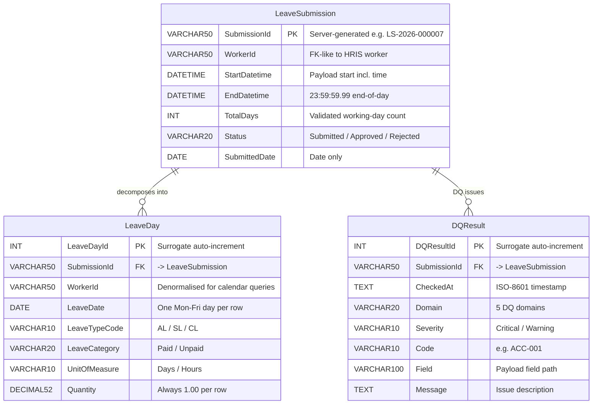

# Solution Design Document (SDD)
## Leave Submission API — Day-Level Persistence

**Version:** 1.5  
**Date:** 2026-03-27  
**Endpoint:** `POST /api/v1/leave-submissions`

---

## 1. Overview

This document describes the design and implementation of a REST API that accepts a worker leave submission payload (JSON) and persists the data into SQL Server at a day-by-day granularity.

The system decomposes a submitted leave period into individual working days (Monday–Friday), validates alignment between the submitted metadata and the actual calendar, and writes both a submission header record and one row per working day in a single atomic transaction. A Data Quality (DQ) engine runs 5-domain checks on every submission — all issues are recorded as soft warnings; submissions are never rejected by DQ.

---

## 2. Architecture & Technology Stack

| Layer | Technology |
|---|---|
| API framework | FastAPI (Python) |
| Validation | Pydantic v2 |
| Database | SQL Server (via `pyodbc`) · SQLite (PoC via `sqlite3`) |
| Testing | Pytest + FastAPI TestClient |
| Runtime | Uvicorn (ASGI) |
| UI (PoC) | Streamlit |
| DQ engine | Pure-Python (`dq_engine.py`) — 5 domains, 16 rules |

---

## 3. Data Modeling Approach

### 3.1 Primary pattern — OLTP 3NF (Inmon-aligned)

The schema follows a normalised **header–detail (parent–child)** structure, which is the hallmark of Inmon's 3NF enterprise data model philosophy:

- `LeaveSubmission` is the **header** — one row per logical submission event, representing the single source of truth for the submission's identity, status, and date range.
- `LeaveDay` is the **detail** — one row per working day within that submission, each independently traceable back to its parent via `SubmissionId` (FK).

This separation ensures that submission-level attributes (status, approver, comments) are stored exactly once, while day-level granularity is achieved through child rows rather than wide pivoted columns or repeated header data. This aligns with Inmon's principle of capturing data at its **lowest meaningful grain** in a normalised form.

> **SubmissionId design decision:** The spec example `LS-2026-000123` follows a `LS-YYYY-NNNNNN` pattern — a fixed prefix, year, and zero-padded global sequence. `SubmissionId` is the spec-defined `PK` on `LeaveSubmission` and the `FK` target on `LeaveDay`. The ID is **server-generated atomically inside the DB transaction**: `SELECT MAX(sequence) → +1 → INSERT` executes under SQLite's DB-level write lock, serialising concurrent requests and preventing collisions. The `LS-YYYY` year prefix reflects the submission year; the sequence number is global and never resets. A surrogate `Id INT IDENTITY` is listed as a future consideration for high-volume FK join performance (see section 10).

### 3.2 Deliberate denormalisation — Kimball influence

`LeaveDay` carries `WorkerId` as a **repeated column**, even though it could be derived by joining to `LeaveSubmission`. This is a conscious Kimball-style trade-off:

> *"Denormalized for fast calendar queries"* — without this, any query of the form "show me all leave days for worker W in month M" would require a join to `LeaveSubmission`. With it, the query hits a single table and the covering index `IX_LeaveDay_WorkerId_Date` resolves it entirely without a lookup.

In Kimball terms, `LeaveDay` behaves like a **Fact table** (grain = one working day per leave type per submission), and `WorkerId` is a degenerate dimension carried directly on the fact row. The absence of explicit `DimWorker` or `DimLeaveType` tables is intentional — those dimensions are owned by the source HRIS system and are out of scope for this API.

### 3.3 Why not Star Schema or Medallion?

**Star Schema** is optimised for analytical query patterns (aggregations, slicing by dimension). This schema serves an OLTP write path — the priority is transactional integrity, idempotency, and referential consistency, not dimensional drill-down. A Star Schema here would introduce unnecessary join complexity for no read-side benefit in this context.

**Medallion** (Bronze → Silver → Gold) is a lakehouse-layer architecture pattern, typically implemented in Databricks or similar platforms. It is not applicable to a relational SQL Server OLTP store.

### 3.4 Summary

| Characteristic | Pattern applied | Evidence in schema |
|---|---|---|
| Header–detail normalisation | Inmon 3NF | `LeaveSubmission` → `LeaveDay` via FK |
| Single source of truth | Inmon | `SubmissionId` as spec-defined PK, server-generated atomically as `LS-YYYY-NNNNNN` |
| Performance denormalisation | Kimball | `WorkerId` repeated on `LeaveDay` |
| Day-level fact grain | Kimball Fact table concept | One row per Mon–Fri day per leave type |
| Dimensional lookups | Out of scope | No `DimWorker` / `DimLeaveType` tables |
| Star Schema | Not applied | OLTP write path, not analytical read path |
| Medallion | Not applicable | SQL Server OLTP, not a lakehouse |

---

## 4. Request Flow

| Step | Stage | Tag | Description |
|------|-------|-----|-------------|
| 1 | Parse & structural validate | Pydantic | All required fields must be present. Field types are coerced (e.g. `startDate` string → `datetime`). Missing or wrong-type fields return `HTTP 422` immediately. |
| 2 | Date order check | model_validator | A Pydantic model validator on `LeavePeriod` asserts `startDate ≤ endDate`. Raises `HTTP 422` if violated. |
| 3 | Working-day alignment check | Business rule | Counts actual Mon–Fri days in the range. Must equal `totalWorkingDays` AND the sum of `leaveDetail.quantity` (for "Days" unit). Returns `HTTP 400` on mismatch. |
| 4 | DQ checks | DQ engine | Runs 16 rules across 5 domains (Accuracy, Completeness, Consistency, Timeliness, Uniqueness). All issues are soft warnings — submission always proceeds. Issues are returned in `dq_issues` and persisted to `DQResult`. |
| 5 | Day decomposition | Business logic | Iterates calendar days from start → end, emitting one `LeaveDayRecord` per Mon–Fri day. Per-day quantity is always `1.00` regardless of the total. |
| 6 | Atomic DB write + ID generation | DB transaction | Inside a single transaction: `SELECT MAX(sequence) → +1` generates `SubmissionId`; header is inserted; all `LeaveDay` rows are bulk-inserted via `executemany`. Rolled back entirely on any error. Returns `final_id`. |
| 7 | 201 Created response | Done | Returns server-generated `submissionId`, `workerId`, `totalWorkingDaysCreated`, full list of `leaveDays`, and `dq_issues` array (empty if no issues). |

---

## 5. Day Decomposition

**Sample payload: 2 Mar – 20 Mar 2026**

The 3-week period contains **15 working days** (Mon–Fri). Weekends are skipped — 6 days in total across 3 weekends.

| Mon | Tue | Wed | Thu | Fri | Sat | Sun |
|-----|-----|-----|-----|-----|-----|-----|
| 03/02 ✓ | 03/03 ✓ | 03/04 ✓ | 03/05 ✓ | 03/06 ✓ | 03/07 — | 03/08 — |
| 03/09 ✓ | 03/10 ✓ | 03/11 ✓ | 03/12 ✓ | 03/13 ✓ | 03/14 — | 03/15 — |
| 03/16 ✓ | 03/17 ✓ | 03/18 ✓ | 03/19 ✓ | 03/20 ✓ | — | — |

> ✓ Working day — persisted to `dbo.LeaveDay` &nbsp;|&nbsp; — Weekend, skipped

Each working day produces 1 row in `dbo.LeaveDay` with `LeaveTypeCode = AL`, `Quantity = 1.00`, linked to `LS-2026-000123`.

Public holidays are out of scope and are not excluded by the current implementation.

---

## 6. Database Schema

### 6.1 dbo.LeaveSubmission

One row per submission. `SubmissionId` is the spec-defined `PK` — server-generated atomically inside the DB transaction as `LS-YYYY-NNNNNN`.

| Column | Type | Notes |
|--------|------|-------|
| **SubmissionId** `PK` | `VARCHAR(50)` | Server-generated e.g. `LS-2026-000007` |
| WorkerId | `VARCHAR(50)` | FK-like; worker table not in scope |
| StartDatetime | `DATETIME` | Preserves time component from payload |
| EndDatetime | `DATETIME` | 23:59:59.99 for end-of-day semantics |
| TotalDays | `INT` | Matches validated working-day count |
| Status | `VARCHAR(20)` | Submitted / Approved / Rejected |
| SubmittedDate | `DATE` | Date only, no time |

### 6.2 dbo.LeaveDay

One row per working day per leave type. The unique constraint on `(SubmissionId, LeaveDate, LeaveTypeCode)` prevents duplicate day entries **within the same submission** at the database level. Note: a worker may legitimately hold leave on the same date across different submissions (e.g. resubmissions after cancellation), so the constraint is scoped to `SubmissionId`, not `WorkerId`.

| Column | Type | Notes |
|--------|------|-------|
| **LeaveDayId** `PK` | `INT IDENTITY` | Surrogate, auto-increment |
| SubmissionId `FK` | `VARCHAR(50)` | → LeaveSubmission.SubmissionId (PK) |
| WorkerId | `VARCHAR(50)` | Denormalized for fast calendar queries (Kimball pattern) |
| LeaveDate | `DATE` | One Mon–Fri day per row |
| LeaveTypeCode | `VARCHAR(10)` | AL, SL, CL … |
| LeaveCategory | `VARCHAR(20)` | Paid / Unpaid |
| UnitOfMeasure | `VARCHAR(10)` | Days / Hours |
| Quantity | `DECIMAL(5,2)` | Always 1.00 per day row |

**Indexes:** `IX_LeaveDay_SubmissionId` · `IX_LeaveDay_WorkerId_Date` · `UQ (SubmissionId, LeaveDate, LeaveTypeCode)`

### 6.3 dbo.DQResult

One row per DQ issue per submission. Written after successful persist — issues never block submission.

| Column | Type | Notes |
|--------|------|-------|
| **DQResultId** `PK` | `INT IDENTITY` | Surrogate, auto-increment |
| SubmissionId `FK` | `VARCHAR(50)` | → LeaveSubmission.SubmissionId |
| CheckedAt | `DATETIME` | ISO-8601 timestamp of check |
| Domain | `VARCHAR(20)` | Accuracy / Completeness / Consistency / Timeliness / Uniqueness |
| Severity | `VARCHAR(10)` | Critical / Warning (all soft — no reject) |
| Code | `VARCHAR(10)` | e.g. ACC-001 |
| Field | `VARCHAR(100)` | Affected payload field path |
| Message | `TEXT` | Human-readable issue description |

**Indexes:** `IX_DQResult_SubmissionId` · `IX_DQResult_Domain_Severity`

### 6.4 Entity relationship



> `||--o{` — `LeaveSubmission` 1건은 0개 이상의 `LeaveDay`로 분해됨. `SubmissionId`는 스펙 정의 PK이자 DB 트랜잭션 안에서 원자적으로 생성되는 `LS-YYYY-NNNNNN` 값. `WorkerId`가 양쪽 테이블에 존재하는 것이 Kimball 스타일 비정규화 포인트 (섹션 3.2 참조).

---

## 7. HTTP Responses

| Code | Status | Description |
|------|--------|-------------|
| `201` | Created | Submission accepted, all day rows written. Response includes `totalWorkingDaysCreated` and the full `leaveDays` array. |
| `400` | Bad Request — business rule violation | Actual Mon–Fri count doesn't match `totalWorkingDays`, or quantity sum is inconsistent. Message describes the mismatch numerically. |
| `409` | Conflict — concurrent race condition | Two requests generated the same sequence number simultaneously. The UI retries automatically with a refreshed ID. Not expected in normal operation. |
| `422` | Unprocessable Entity — validation failure | Required fields missing, wrong types, or constraint violations caught by Pydantic (e.g. `startDate > endDate`, empty `leaveDetails`). |
| `500` | Internal Server Error | Database connection failure or unexpected exception. Transaction is rolled back — no partial data is written. Safe to retry with the same payload. |

---

## 8. File Structure

**Production (SQL Server)**

| File | Purpose |
|---|---|
| `schema.sql` | DDL — creates both tables with PK, FK, unique constraint, and indexes |
| `models.py` | Pydantic v2 request/response schemas |
| `business_logic.py` | Pure-Python day decomposition and alignment validation (no DB dependency) |
| `database.py` | `pyodbc` persistence layer — single context manager wraps commit/rollback |
| `main.py` | FastAPI app with the POST endpoint and global exception handlers |
| `tests/test_leave_submission.py` | Pytest suite — DB is mocked; covers all HTTP status codes |

**PoC (SQLite)**

| File | Purpose |
|---|---|
| `poc/db_setup.py` | DDL + `create_database()` — SQLite schema, self-healing on every connection |
| `poc/models.py` | Pydantic v2 schemas (shared with production) |
| `poc/business_logic.py` | Working-day decomposition, alignment validation, ID generation |
| `poc/database_sqlite.py` | SQLite persistence layer with verbose diagnostic logging |
| `poc/dq_engine.py` | DQ engine — 5 domains, 16 rules, soft-warning only |
| `poc/main.py` | FastAPI app — BDAXAI patterns (`lifespan`, `writelog`, `POWERHOUSE_*` env vars) |
| `poc/tests/test.py` | Pytest suite — in-memory SQLite, no file I/O required |
| `poc/app.py` | Streamlit UI — Submit Leave, Leave Balance, Browse DB, DQ Dashboard (Report + Rules tabs) |
| `poc/.env` | Environment config (`POWERHOUSE_DB_PATH`, `POWERHOUSE_POC_SERVER_PORT`, etc.) |

---

## 9. Running Locally

**Production:**
```bash
pip install -r requirements.txt
uvicorn main:app --reload          # API at http://localhost:8000
pytest tests/ -v                   # Full test suite (DB mocked)
```

**PoC (SQLite):**
```bash
cd poc
pip install -r requirements.txt
del data\leave.db                  # reset DB if schema changed
uvicorn main:app --port 8090 --reload
streamlit run app.py               # UI at http://localhost:8501
pytest tests/ -v                   # in-memory SQLite, no DB file needed
```

---

## 10. Known Constraints & Future Considerations

| Item | Current state | Suggested next step |
|---|---|---|
| Public holidays | Out of scope — not excluded from working-day count | Integrate a public holiday calendar (e.g. `holidays` Python library) into `_is_working_day()` |
| Part-day leave | `Quantity` fixed at `1.00` per day row | Extend decomposition logic to accept fractional quantities (e.g. half-days) |
| Multiple leave types in one period | Supported — each `leaveDetail` item produces its own set of day rows | Validate that quantities across types sum to `totalWorkingDays` |
| Concurrency (SQLite) | SQLite serialises writes via DB-level lock — safe for PoC, bottleneck under high load | Use SQL Server `SEQUENCE` object or `NEWSEQUENTIALID()` for production concurrent writes |
| DQ — all soft warnings | No submission is rejected for DQ; issues are logged only | Introduce `Critical` severity reject path when governance matures |
| DQ — public holiday | Working-day check excludes weekends but not public holidays | Integrate `holidays` library into `_is_working_day()` |
| Surrogate PK | `SubmissionId VARCHAR(50)` is the spec PK — VARCHAR FK joins are slower than INT | Add `Id INT IDENTITY` surrogate PK if high join volume becomes a concern |
| Worker dimension | `WorkerId` is a bare string with no FK to a worker table | Add `dbo.Worker` reference table and enforce referential integrity |
| Analytical reporting | Current schema is OLTP-optimised | For reporting, consider a Gold-layer view or Star Schema projection on top of these tables |

---

## 11. Alternative Solution Comparison — Node.js + Express vs Python + FastAPI

An alternative implementation using **Node.js, Express, and `mssql`** was reviewed against this solution. The two approaches share the same core logic (working-day decomposition, transactional persistence, FK structure, `Quantity = 1.00` per day), but differ in completeness and production-readiness.

### 11.1 Feature comparison

| Item | Node.js + Express | Python + FastAPI | Assessment |
|---|---|---|---|
| Runtime & framework | Node.js + Express | Python + FastAPI | Functionally equivalent |
| Input field casing | `LEAVESUBMISSION`, `WORKERID` (UPPERCASE) | `leaveSubmission`, `workerId` (camelCase) | ⚠️ Node.js deviates from the payload spec |
| Input validation | Manual `if` checks | Pydantic v2 automatic | ⚠️ Node.js risks runtime errors on missing nested fields |
| Duplicate submission handling | ❌ Not implemented | ✅ HTTP 409 returned | ⚠️ Node.js lets DB constraint violation surface as HTTP 500 |
| `leaveDetail` quantity sum check | ❌ Not implemented | ✅ Validated against `totalWorkingDays` | ⚠️ Node.js skips this business rule |
| Multiple `leaveDetails` support | ❌ Hardcoded `[0]` only | ✅ Full iteration over all items | ⚠️ Node.js silently drops all but the first leave type |
| DB insert strategy | `await` per row in loop (N+1) | `executemany` batch | ⚠️ Node.js makes 15 round-trips for a 15-day submission |
| Index definitions in DDL | ❌ None | ✅ 2 indexes + UQ constraint | ⚠️ Node.js calendar queries will be slower without indexes |
| HTTP status code granularity | `400` for all errors | `400` / `409` / `422` / `500` distinct | ⚠️ Node.js is less RESTful — clients cannot distinguish error types |
| Test coverage | ❌ None | ✅ Pytest suite, DB mocked | ⚠️ Node.js behaviour cannot be verified without a live DB |

### 11.2 Key risks in the Node.js + Express solution

**Risk 1 — Duplicate submission surfaces as HTTP 500.**
Without an explicit idempotency check, a repeated `SubmissionId` hits the DB `PRIMARY KEY` constraint and returns a generic `500 Internal Server Error`. The caller cannot distinguish a server fault from a duplicate submission, making safe retry logic impossible.

**Risk 2 — `leaveDetails[0]` hardcoding.**
The comment in the source acknowledges this: `// Assuming single type for simplicity`. In production, any payload with multiple leave types would silently persist only the first type's days — a data integrity failure with no error raised.

**Risk 3 — N+1 insert pattern.**
Inserting each `LeaveDay` row in a sequential `await` loop means 15 database round-trips for a 15-day submission, 65 for a quarter, and so on. The `executemany` batch approach in Python + FastAPI reduces that to a single network call.

### 11.3 Verdict

The Node.js + Express solution is a **functional prototype** that demonstrates the correct conceptual approach. It would work correctly for the happy-path case in a controlled demo. Python + FastAPI targets **production readiness** — covering idempotency, multi-type leave, batch persistence, index-backed queries, and a full test suite.

---

## 12. Streamlit UI (PoC)

A three-page Streamlit application (`poc/app.py`) provides a human-friendly interface over the SQLite PoC.

### 12.1 Pages

| Page | Description |
|---|---|
| **Submit Leave** | Form-based leave submission. `SubmissionId` is read-only — auto-calculated from `MAX(sequence)+1` queried from the DB on page load. Date pickers are outside `st.form` to trigger live reruns; working-day count and `Quantity` update instantly as dates change. |
| **Leave Balance** | Worker filter, KPI cards (total days, worker count, leave types), bar chart, and summary table — all sourced directly from SQLite. |
| **Browse DB** | `LeaveSubmission` and `LeaveDay` tabs with multi-select filters. Drill-down: selecting a `SubmissionId` shows its day rows inline. DB stats footer (row counts, file size). |

### 12.2 SubmissionId concurrency in the UI

The UI reads `MAX(sequence)` from the DB to pre-fill the read-only Submission ID field. This is a best-effort display only — the actual ID is generated atomically server-side inside the DB transaction. If two users submit simultaneously and the UI shows the same ID to both:

1. One request succeeds (DB write lock serialises the INSERT).
2. The other receives `HTTP 409` and the UI **automatically retries once** with a refreshed ID.
3. The user sees no error — the retry is silent.

### 12.3 Running

```bash
cd poc
# Terminal 1 — API
uvicorn main:app --port 8090 --reload

# Terminal 2 — UI
streamlit run app.py
```
---

## 13. API Specification

### 13.1 POST /api/v1/leave-submissions

**Summary:** Submit a worker leave request.
`submissionId` is server-generated (LS-YYYY-NNNNNN) — the field may be present in the payload but is ignored; the server atomically generates the ID inside the DB transaction.

#### Request body — `application/json`

```json
{
  "leaveSubmission": {
    "submissionId": "LS-2026-000123",
    "submittedDate": "2026-02-15",
    "status": "Submitted",
    "worker": {
      "workerId": "W123456",
      "employeeNumber": "90030366",
      "sourceSystem": "HRIS"
    },
    "leavePeriod": {
      "startDate": "2026-03-02 00:00:00.00",
      "endDate": "2026-03-20 23:59:59.99",
      "totalWeeks": 3,
      "totalWorkingDays": 15
    },
    "leaveDetails": [
      {
        "leaveTypeCode": "AL",
        "leaveTypeDescription": "Annual Leave",
        "leaveCategory": "Paid",
        "unitOfMeasure": "Days",
        "quantity": 15
      }
    ],
    "approver": {
      "approverId": "M987654",
      "approvalStatus": "Pending"
    },
    "comments": "Planned annual leave for personal travel."
  }
}
```

#### Responses

| Code | Description | Schema |
|------|-------------|--------|
| `201` | Submission created successfully | `LeaveSubmissionResponse` |
| `400` | Business rule violation | `ErrorResponse` |
| `409` | Concurrent race condition (auto-retried by UI) | `ErrorResponse` |
| `422` | Request validation failed | `ErrorResponse` |
| `500` | Internal server error | `ErrorResponse` |

**`LeaveSubmissionResponse` (201):**
```json
{
  "submissionId": "LS-2026-000007",
  "workerId": "W123456",
  "status": "Submitted",
  "totalWorkingDaysCreated": 15,
  "leaveDays": [
    {
      "leaveDate": "2026-03-02",
      "leaveTypeCode": "AL",
      "leaveCategory": "Paid",
      "unitOfMeasure": "Days",
      "quantity": 1.0
    }
  ],
  "dq_issues": [
    {
      "domain": "Accuracy",
      "severity": "Warning",
      "code": "ACC-001",
      "field": "worker.workerId",
      "message": "workerId 'W123' does not match expected pattern W######."
    }
  ]
}
```

**`ErrorResponse` (400 / 409 / 422 / 500):**
```json
{
  "error": "string",
  "detail": "string"
}
```

> **Note:** `quantity` is serialised as `float` (not `Decimal`) to avoid OpenAPI schema artifacts.

---

### 13.2 GET /api/v1/leave-submissions/{submission_id}

**Summary:** Retrieve a submission header and all its day records.

#### Parameters

| Name | In | Type | Required | Description |
|---|---|---|---|---|
| `submission_id` | path | string | ✅ | e.g. `LS-2026-000007` |

#### Example request

```bash
curl -X GET 'http://localhost:8090/api/v1/leave-submissions/LS-2026-000007' \
  -H 'accept: application/json'
```

#### Responses

| Code | Description | Schema |
|------|-------------|--------|
| `200` | Submission found | `GetSubmissionResponse` |
| `404` | Submission not found | `ErrorResponse` |
| `422` | Validation error | FastAPI default |

**`GetSubmissionResponse` (200):**
```json
{
  "submission": {
    "SubmissionId": "LS-2026-000007",
    "WorkerId": "W123456",
    "StartDatetime": "2026-03-02T00:00:00",
    "EndDatetime": "2026-03-20T23:59:59.990000",
    "TotalDays": 15,
    "Status": "Submitted",
    "SubmittedDate": "2026-02-15"
  },
  "leaveDays": [
    {
      "LeaveDayId": 1,
      "SubmissionId": "LS-2026-000007",
      "WorkerId": "W123456",
      "LeaveDate": "2026-03-02",
      "LeaveTypeCode": "AL",
      "LeaveCategory": "Paid",
      "UnitOfMeasure": "Days",
      "Quantity": 1.0
    }
  ]
}
```

**`ErrorResponse` (404):**
```json
{
  "detail": "Submission 'LS-2026-000007' not found."
}
```
---

## 14. Data Quality Engine

### 14.1 Design principles

- **5 domains** — Accuracy, Completeness, Consistency, Timeliness, Uniqueness (per DQ-basics framework)
- **Soft warnings only** — all issues are recorded; no submission is rejected by DQ
- **Separation of concerns** — `dq_engine.py` is pure Python with no DB dependency; testable in isolation
- **Extensible** — add rules by appending to the relevant `_check_*` function

### 14.2 Rule catalogue

| Code | Domain | Severity | Field | Rule |
|---|---|---|---|---|
| ACC-001 | Accuracy | Warning | `worker.workerId` | Must match `W######` pattern |
| ACC-002 | Accuracy | Warning | `submissionId` | Must match `LS-YYYY-NNNNNN` pattern |
| ACC-003 | Accuracy | Warning | `leaveDetails[*].leaveTypeCode` | Must be one of: AL, SL, CL, UL, PL, LWP |
| ACC-004 | Accuracy | Warning | `leaveDetails[*].leaveCategory` | Must be one of: Paid, Unpaid |
| ACC-005 | Accuracy | Warning | `leaveDetails[*].unitOfMeasure` | Must be one of: Days, Hours |
| ACC-006 | Accuracy | Warning | `status` | Must be one of: Submitted, Draft, Pending |
| CMP-001 | Completeness | Warning | `approver.approverId` | Required for non-Draft submissions |
| CMP-002 | Completeness | Warning | `comments` | Recommended for Pending status |
| CMP-003 | Completeness | Warning | `worker.employeeNumber` | Must not be blank |
| CON-001 | Consistency | Warning | `leavePeriod.totalWeeks` | Must be within ±1 of calculated weeks from date range |
| CON-002 | Consistency | Warning | `leaveDetails[*].quantity` | Sum of quantity (Days UOM) must equal `totalWorkingDays` |
| CON-003 | Consistency | Warning | `submittedDate` | Must not be after `leavePeriod.startDate` |
| TML-001 | Timeliness | Warning | `leavePeriod.startDate` | `startDate` > 30 days in the past |
| TML-002 | Timeliness | Warning | `leavePeriod.startDate` | `startDate` > 365 days in the future |
| TML-003 | Timeliness | Warning | `submittedDate` | Must not be a future date |
| UNQ-001 | Uniqueness | Warning | `leavePeriod` | Overlapping leave dates for the same `workerId` |

### 14.3 Execution flow

```
POST payload received
  → run_dq_checks(payload, existing_dates_fn)
      → _check_accuracy()
      → _check_completeness()
      → _check_consistency()
      → _check_timeliness()
      → _check_uniqueness()   ← queries LeaveDay for existing dates
  → DQResult(issues=[...], passed=True)  ← always passes
  → DB persist (submission + leave days)
  → persist_dq_results(final_id, issues)  ← written to DQResult table
  → 201 response with dq_issues array
```

### 14.4 Streamlit DQ Dashboard

Two tabs in the **🔍 DQ Dashboard** page:

**📋 Report tab**
- KPI cards: total issues, critical count, warning count, affected submissions
- Issues by domain and by code (aggregated)
- Filtered issue log with severity colour coding

**📖 Rules tab**
- Full rule catalogue table (Code, Domain, Severity, Field, Rule, Logic) with domain colour coding
- Domain filter (multiselect)
- Reference values: leave type codes, category/UOM allowed values, timeliness thresholds