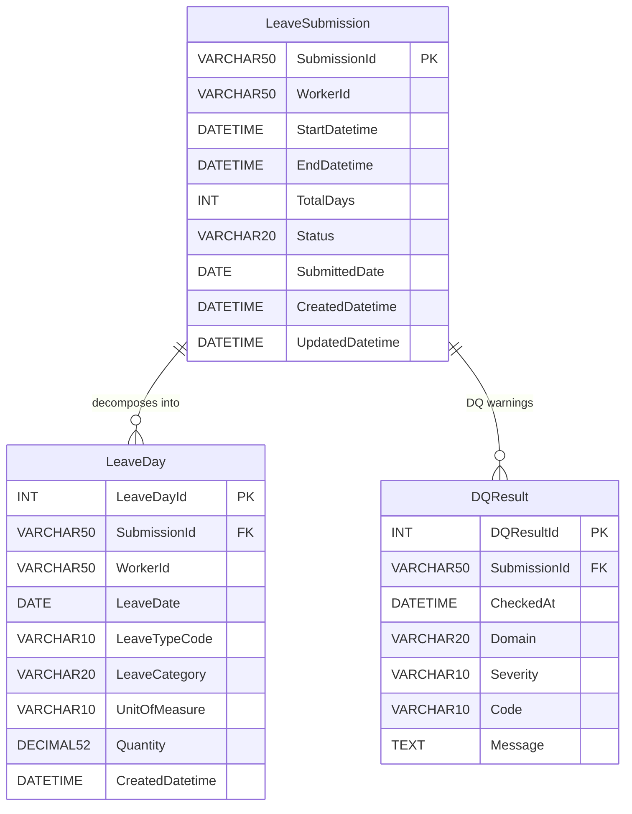

# Solution Design Document (SDD)
## Leave Submission API — Day-Level Persistence

---

## 1. Document Control

```
Document Title:  Leave Submission API — Day-Level Persistence
Version:         2.4
Date:            2026-04-07
Author(s):       Bomyung Kim
Reviewer(s):     —
Approver(s):     —
```

| Version | Date | Author | Description |
|---|---|---|---|
| 1.0 | 2026-03-27 | # Solution Design Document (SDD)
## Leave Submission API — Day-Level Persistence

---

## 1. Document Control

```
Document Title:  Leave Submission API — Day-Level Persistence
Version:         2.4
Date:            2026-04-07
Author(s):       Bomyung Kim
Reviewer(s):     —
Approver(s):     —
```

| Version | Date | Description |
|---|---|---|
| 1.0 | 2026-03-27 | Initial draft — SQL Server production schema |
| 1.2 | 2026-03-27 | SQLite PoC + Streamlit UI added |
| 1.3 | 2026-03-27 | Atomic SubmissionId + concurrency handling |
| 1.4 | 2026-03-27 | API specification section |
| 1.5 | 2026-03-27 | DQ engine + DQResult table |
| 1.6 | 2026-03-27 | Assessment compliance note + dual-mode SubmissionId |
| 1.7 | 2026-03-29 | SQL Server SP layer, UNQ-001 hard reject, Appendix restructure |
| 2.0 | 2026-03-29 | Full restructure to standard SDD template |
| 2.2 | 2026-04-01 | SCD type classification at table level (§7.3); audit fields CreatedDatetime / UpdatedDatetime added to LeaveSubmission and LeaveDay; SCD Type 2 evolution path added to §15 |


---

## 2. Executive Summary

**Purpose**

Design and implement a REST API endpoint that accepts a worker leave submission payload (JSON) and persists the data into SQL Server at a day-by-day granularity. A SQLite-based PoC is provided for local development and demonstration without infrastructure dependencies.

**Scope**

| In scope | Out of scope |
|---|---|
| POST `/api/v1/leave-submissions` — accept, validate, decompose, persist | Leave approval workflow |
| GET `/api/v1/leave-submissions/{id}` — retrieve submission + day records | Worker master data / HRIS integration |
| Mon–Fri working-day decomposition | Public holiday calendar |
| SQL Server schema (`LeaveSubmission`, `LeaveDay`) + stored procedure | Part-day / half-day leave |
| SQLite PoC with Streamlit UI ⭐ bonus | Authentication / authorisation |
| DQ engine — 5 domains, 16 rules ⭐ bonus | Reporting / analytics layer |

**Objectives**

- Fully satisfy the assessment specification (POST endpoint, validation, Mon–Fri decomposition, SQL Server schema)
- Demonstrate production-readiness: idempotency, atomic transactions, batch persistence, index-backed queries, full test coverage
- Provide a locally runnable PoC (SQLite + Streamlit) as a bonus deliverable

> **Assessment compliance note:** All bonus deliverables (SQLite PoC, DQ engine, Streamlit UI, server-generated SubmissionId fallback) are clearly separated from the core assessment solution.

---

## 3. Business Context

**Problem Statement**

Workers submit leave requests covering multi-day periods. The current approach stores only the header-level submission record, making it impossible to query leave usage at the individual calendar-day grain. This prevents accurate leave balance calculations, overlap detection, and regulatory reporting at the day level.

**Stakeholders**

| Role | Party | Interest |
|---|---|---|
| Business owner | HR Operations | Accurate leave records and balance visibility |
| Developer | Assessment candidate | Demonstrate API + DB design skills |
| System | HRIS | Source of worker master data (read-only reference) |
| System | Payroll | Downstream consumer of day-level leave records |

**Assumptions**

- Working days are Monday–Friday only; public holidays are out of scope
- `WorkerId` is a valid HRIS identifier — no FK enforcement to a worker table in scope
- A single leave submission may contain multiple leave types (e.g. AL + SL in one period)
- `submissionId` follows the pattern `LS-YYYY-NNNNNN`; caller may supply it or omit for server generation
- Quantity per day row is always `1.00` regardless of the unit of measure

**Constraints**

| Category | Constraint |
|---|---|
| Technology | Python + FastAPI; SQL Server for production DB |
| Schema | `LeaveSubmission` and `LeaveDay` column definitions are fixed by the assessment spec |
| Timeline | Single-developer assessment task |
| Infrastructure | PoC must run without SQL Server — SQLite used for local development |

---

## 4. Functional Requirements

| ID | Requirement | Description | Priority |
|---|---|---|---|
| FR-01 | POST endpoint | Accept leave submission JSON at `POST /api/v1/leave-submissions` | High |
| FR-02 | Payload validation | Validate required fields, field types, and `startDate ≤ endDate` | High |
| FR-03 | Working-day alignment | Verify `totalWorkingDays` and quantity sum match actual Mon–Fri count | High |
| FR-04 | Day decomposition | Expand leave period into one record per Mon–Fri working day | High |
| FR-05 | Atomic persistence | Write `LeaveSubmission` header + all `LeaveDay` rows in a single transaction | High |
| FR-06 | Idempotency | Return HTTP 409 if a duplicate `submissionId` is submitted | High |
| FR-07 | GET endpoint | Retrieve a submission header and all its day records by `submissionId` | Medium |
| FR-08 | Error responses | Return appropriate HTTP status codes (400, 409, 422, 500) with descriptive messages | High |
| FR-09 | SubmissionId generation | Auto-generate `LS-YYYY-NNNNNN` from DB `MAX(sequence)+1` if caller omits the field | Medium |
| FR-10 | DQ engine ⭐ | Run 16 data-quality rules across 5 domains on every submission | Bonus |
| FR-11 | Overlap detection ⭐ | Reject (HTTP 400) submissions that overlap existing leave dates for the same worker | Bonus |
| FR-12 | Streamlit UI ⭐ | Provide a 4-page web UI for submit, balance, admin, and DQ dashboard | Bonus |

---

## 5. Non-Functional Requirements

| Category | Requirement |
|---|---|
| Performance | API response < 500 ms for a 15-day submission under normal load |
| Scalability | Stateless FastAPI service — horizontally scalable behind a load balancer |
| Availability | Target 99.9% uptime in production; SQLite PoC for local dev only |
| Reliability | All DB writes are atomic (transaction + rollback) — no partial data persisted on failure |
| Auditability | Full day-level traceability: every working day linked back to its parent `SubmissionId` |
| Logging | Structured timestamped logs (`YYYY-MM-DD HH:MM:SS | LEVEL | [MODULE.fn] message`) written to file and stdout |
| Testability | Business logic and validation are pure Python with no DB dependency — fully unit-testable; integration tests use in-memory SQLite |
| Portability | DB layer is swappable (SQLite ↔ SQL Server) via a single env var — no other code changes required |
| Security | API runs over HTTP in PoC; TLS 1.2+ required in production; no authentication implemented in scope |
| Maintainability | DQ rules are isolated in `dq_engine.py` — adding a rule requires one function addition, no core changes |

---

## 6. High-Level Architecture

**Architecture style:** RESTful API · Monolithic service (PoC) · Swappable DB layer

```
┌──────────────┐     POST/GET      ┌────────────────────────────────┐
│   Client     │ ──────────────── ▶│        FastAPI (main.py)       │
│ (curl/UI/API)│                   │                                │
└──────────────┘                   │  ┌──────────────────────────┐  │
                                   │  │  Pydantic v2 validation  │  │
┌──────────────┐                   │  └──────────────────────────┘  │
│ Streamlit UI │ ── HTTP (local) ─▶│  ┌──────────────────────────┐  │
│  (app.py)    │  ⭐ bonus          │  │   business_logic.py      │  │
└──────────────┘                   │  │  day decomposition       │  │
                                   │  └──────────────────────────┘  │
                                   │  ┌──────────────────────────┐  │
                                   │  │   dq_engine.py  ⭐       │  │
                                   │  │  5 domains, 16 rules     │  │
                                   │  └──────────────────────────┘  │
                                   │  ┌──────────────────────────┐  │
                                   │  │  database.py /           │  │
                                   │  │  database_sqlite.py      │  │
                                   │  └──────────────┬───────────┘  │
                                   └─────────────────┼──────────────┘
                                                     │
                          ┌──────────────────────────┴──────────────────────────┐
                          │                                                     │
                   ┌──────▼──────┐                                    ┌─────────▼───────┐
                   │  SQL Server │                                    │  SQLite (PoC)   │
                   │  LeaveDB    │  ← production                     │  data/leave.db  │
                   │  + SP       │                                    │                 │
                   └─────────────┘                                    └─────────────────┘
```

**Technology stack**

| Layer | Technology |
|---|---|
| API framework | FastAPI (Python) |
| Validation | Pydantic v2 |
| Business logic | Pure Python (`business_logic.py`, `dq_engine.py`) |
| DB — production | SQL Server via `pyodbc` + `usp_PersistLeaveSubmission` SP |
| DB — PoC | SQLite via `sqlite3` (stdlib) |
| UI — PoC ⭐ | Streamlit |
| Testing | Pytest + FastAPI TestClient (in-memory SQLite) |
| Runtime | Uvicorn (ASGI) |

---

## 7. Detailed Design

### 7.1 API Specification

**Endpoints**

| Method | Path | Description |
|---|---|---|
| `POST` | `/api/v1/leave-submissions` | Submit a leave request |
| `GET` | `/api/v1/leave-submissions/{submission_id}` | Retrieve submission + day records |
| `GET` | `/health` | Liveness check |

**POST — Request body (`application/json`)**

```json
{
  "leaveSubmission": {
    "submissionId": "LS-2026-000123",
    "submittedDate": "2026-02-15",
    "status": "Submitted",
    "worker": {
      "workerId": "W123456",
      "employeeNumber": "90030366",
      "sourceSystem": "HRIS"
    },
    "leavePeriod": {
      "startDate": "2026-03-02 00:00:00.00",
      "endDate": "2026-03-20 23:59:59.99",
      "totalWeeks": 3,
      "totalWorkingDays": 15
    },
    "leaveDetails": [
      {
        "leaveTypeCode": "AL",
        "leaveTypeDescription": "Annual Leave",
        "leaveCategory": "Paid",
        "unitOfMeasure": "Days",
        "quantity": 15
      }
    ],
    "approver": {
      "approverId": "M987654",
      "approvalStatus": "Pending"
    },
    "comments": "Planned annual leave for personal travel."
  }
}
```

> `submissionId` is optional — if omitted the server generates `LS-YYYY-NNNNNN` from `MAX(sequence)+1`.

**POST — HTTP status codes**

| Code | Scenario | Description |
|---|---|---|
| `201` | Success | Submission created; all day rows written |
| `400` | Business rule violation | Working-day mismatch, quantity error, or UNQ-001 DQ rejection |
| `409` | Duplicate | Caller-supplied `submissionId` already exists |
| `422` | Validation failure | Missing fields, wrong types, or `startDate > endDate` |
| `500` | Server error | DB failure — transaction rolled back, no partial data written |

**GET — Path parameter**

| Name | In | Type | Required | Example |
|---|---|---|---|---|
| `submission_id` | path | string | ✅ | `LS-2026-000007` |

**GET — HTTP status codes**

| Code | Scenario |
|---|---|
| `200` | Submission found — returns header + day records |
| `404` | `submissionId` not found |

---

### 7.2 Business Logic

**Processing flow**

| Step | Stage | Description |
|---|---|---|
| 1 | Parse & validate | Pydantic v2 validates all required fields and types. Returns HTTP 422 on failure. |
| 2 | Date order check | `startDate ≤ endDate` asserted by Pydantic `model_validator`. Returns HTTP 422 if violated. |
| 3 | SubmissionId resolution | If caller supplies `submissionId`: duplicate check → HTTP 409. If omitted: server generates `LS-YYYY-NNNNNN`. |
| 4 | Alignment check | Actual Mon–Fri count must equal `totalWorkingDays` AND sum of `leaveDetail.quantity`. Returns HTTP 400 on mismatch. |
| 5 | DQ checks ⭐ | 16 rules across 5 domains. UNQ-001 (overlap) → HTTP 400, nothing persisted. All other issues are soft warnings. |
| 6 | Day decomposition | Iterates `startDate → endDate`, emitting one `LeaveDayRecord` per Mon–Fri day at `Quantity = 1.00`. |
| 7 | Atomic DB write | Header + day rows written in a single transaction. Rolled back entirely on any error. |
| 8 | 201 response | Returns `submissionId`, `workerId`, `totalWorkingDaysCreated`, `leaveDays`, `dq_issues`. |

**Working-day decomposition example (2 Mar – 20 Mar 2026 → 15 days)**

| Mon | Tue | Wed | Thu | Fri | Sat | Sun |
|-----|-----|-----|-----|-----|-----|-----|
| 03/02 ✓ | 03/03 ✓ | 03/04 ✓ | 03/05 ✓ | 03/06 ✓ | 03/07 — | 03/08 — |
| 03/09 ✓ | 03/10 ✓ | 03/11 ✓ | 03/12 ✓ | 03/13 ✓ | 03/14 — | 03/15 — |
| 03/16 ✓ | 03/17 ✓ | 03/18 ✓ | 03/19 ✓ | 03/20 ✓ | — | — |

> ✓ persisted to `dbo.LeaveDay` · — weekend, skipped

---

### 7.3 Data Model

**Design approach**

The schema follows a normalised header–detail (Inmon 3NF) structure. `WorkerId` is deliberately denormalised on `LeaveDay` (Kimball pattern) to enable fast calendar queries without joining to the header table.

**Entity: dbo.LeaveSubmission** — one row per submission · **SCD Type 1**

| Column | Type | Notes |
|---|---|---|
| **SubmissionId** `PK` | `VARCHAR(50)` | Caller-supplied or server-generated `LS-YYYY-NNNNNN` |
| WorkerId | `VARCHAR(50)` | HRIS external reference |
| StartDatetime | `DATETIME` | Preserves time component from payload |
| EndDatetime | `DATETIME` | 23:59:59.99 end-of-day semantics |
| TotalDays | `INT` | Validated working-day count |
| Status | `VARCHAR(20)` | Submitted / Draft / Pending |
| SubmittedDate | `DATE` | Date only, no time |
| CreatedDatetime | `DATETIME` | Set once on INSERT. SQL Server: `GETDATE()` · SQLite PoC: `strftime('%Y-%m-%d %H:%M:%S', 'now', 'localtime')` |
| UpdatedDatetime | `DATETIME` | Refreshed on every UPDATE; initially equal to `CreatedDatetime`. SQL Server: `GETDATE()` · SQLite PoC: `strftime('%Y-%m-%d %H:%M:%S', 'now', 'localtime')` |

**Entity: dbo.LeaveDay** — one row per Mon–Fri working day · **Fact Table**

| Column | Type | Notes |
|---|---|---|
| **LeaveDayId** `PK` | `INT IDENTITY` | Surrogate, auto-increment |
| SubmissionId `FK` | `VARCHAR(50)` | → LeaveSubmission.SubmissionId |
| WorkerId | `VARCHAR(50)` | Denormalised for fast calendar queries |
| LeaveDate | `DATE` | One Mon–Fri day per row |
| LeaveTypeCode | `VARCHAR(10)` | AL / SL / CL / UL / PL / LWP |
| LeaveCategory | `VARCHAR(20)` | Paid / Unpaid |
| UnitOfMeasure | `VARCHAR(10)` | Days / Hours |
| Quantity | `DECIMAL(5,2)` | Always 1.00 per day row |
| CreatedDatetime | `DATETIME` | Set once on INSERT — append-only fact; no UpdatedDatetime |

**Indexes & constraints:** `IX_LeaveSubmission_WorkerId` · `UQ (SubmissionId, LeaveDate, LeaveTypeCode)` · `IX_LeaveDay_SubmissionId` · `IX_LeaveDay_WorkerId_Date`

**Entity: dbo.DQResult** ⭐ — one row per DQ warning per submission · **Type 0 / Append-Only Event Log**

| Column | Type | Notes |
|---|---|---|
| **DQResultId** `PK` | `INT IDENTITY` | Surrogate, auto-increment |
| SubmissionId `FK` | `VARCHAR(50)` | → LeaveSubmission.SubmissionId |
| CheckedAt | `DATETIME` | Creation timestamp — serves as the audit field for this table; no separate `CreatedDatetime`. SQL Server: `GETDATE()` · SQLite PoC: `strftime('%Y-%m-%d %H:%M:%S', 'now', 'localtime')` |
| Domain | `VARCHAR(20)` | Accuracy / Completeness / Consistency / Timeliness / Uniqueness |
| Severity | `VARCHAR(10)` | Warning only — Critical issues never reach this table |
| Code | `VARCHAR(10)` | e.g. ACC-001 |
| Field | `VARCHAR(100)` | Affected payload field path · **NULLABLE** — omitted for structural rules that span multiple fields |
| Message | `TEXT` | Human-readable description · **NULLABLE** |

**Entity relationship**



---

### 7.4 Data Flow

```
JSON Payload (POST)
        │
        ▼
┌───────────────────┐
│  Pydantic v2      │  ← structural validation (HTTP 422 on fail)
│  validation       │
└────────┬──────────┘
         │
         ▼
┌───────────────────┐
│  SubmissionId     │  ← duplicate check (HTTP 409) or generate LS-YYYY-NNNNNN
│  resolution       │
└────────┬──────────┘
         │
         ▼
┌───────────────────┐
│  Alignment check  │  ← Mon–Fri count vs totalWorkingDays (HTTP 400 on fail)
└────────┬──────────┘
         │
         ▼
┌───────────────────┐
│  DQ engine  ⭐    │  ← 16 rules; UNQ-001 Critical → HTTP 400; others → warnings
└────────┬──────────┘
         │
         ▼
┌───────────────────┐
│  Day decomposition│  ← expand period → [LeaveDayRecord, ...]
└────────┬──────────┘
         │
         ▼
┌───────────────────┐   SQL Server: usp_PersistLeaveSubmission (single SP call)
│  Atomic DB write  │   SQLite PoC: executemany in single connection/transaction
└────────┬──────────┘
         │
         ▼
    HTTP 201 Created
    { submissionId, leaveDays, dq_issues }
```

---

## 8. Integration Design

| System | Interface | Protocol | Direction | Notes |
|---|---|---|---|---|
| HRIS | Worker master data | REST (read-only) | Inbound reference | `WorkerId` validated by pattern only in PoC; FK to worker table out of scope |
| Payroll | Leave export | Batch / API | Outbound | Downstream consumer of `dbo.LeaveDay` day-level records |
| Event bus (future) | Submission events | Kafka / Service Bus | Outbound | Publish `LeaveSubmitted` event on 201 — enables downstream consumers (Payroll, DAMS, notifications) to subscribe without polling |
| Streamlit UI ⭐ | HTTP REST | HTTP (localhost) | Inbound | Calls `POST /api/v1/leave-submissions` and reads SQLite directly for balance/admin pages |

> No live integration is implemented in this PoC. `WorkerId` is accepted as a bare string; HRIS and Payroll are identified as future integration targets.

> **Museum / DAMS applicability note:** The same header-detail pattern, DQ engine, and metadata governance model applied here translates directly to collection asset ingestion workflows — replacing `LeaveSubmission` with a collection item record and `LeaveDay` with asset-level provenance or digitisation event rows. The DQ domain rules (Accuracy, Completeness, Consistency) map cleanly to collection metadata standards (e.g. Dublin Core, Spectrum).

---

## 9. Security Design

| Control | Current (PoC) | Production target |
|---|---|---|
| Authentication | None | OAuth2 / JWT bearer token |
| Authorisation | None | RBAC — workers can submit own leave; managers can view all |
| Transport security | HTTP (localhost only) | TLS 1.2+ mandatory |
| Input sanitisation | Pydantic v2 strict type coercion | Same — no raw SQL from user input |
| SQL injection | N/A — parameterised queries throughout (`?` placeholders) | Same |
| Secrets management | `.env` file (local) | Azure Key Vault / AWS Secrets Manager |
| Data masking | Not implemented | Mask `WorkerId` and `approverId` in logs |
| Audit trail | Full day-level records in `LeaveDay` + DQ log in `DQResult` | Same + immutable audit log table |

---

## 10. Error Handling Strategy

| Scenario | HTTP Code | Handling |
|---|---|---|
| Missing / wrong-type field | 422 | Pydantic raises `ValidationError` → FastAPI returns 422 with field-level detail |
| `startDate > endDate` | 422 | Pydantic `model_validator` raises `ValueError` |
| Working-day mismatch | 400 | `validate_working_day_alignment()` raises `ValueError` → caught in endpoint |
| DQ Critical (UNQ-001 overlap) | 400 | `run_dq_checks()` returns `passed=False` → HTTP 400 with `dq_issues` array |
| Duplicate `submissionId` | 409 | `submission_exists()` checked before write; SQL Server SP also raises `THROW 50409` |
| DB connection failure | 500 | `get_connection()` context manager catches exception → rollback → HTTP 500 |
| Partial write | 500 | `XACT_ABORT ON` (SQL Server) / explicit `rollback()` (SQLite) — no partial data persisted |

All error responses follow `ErrorResponse` schema:
```json
{ "error": "string", "detail": "string" }
```

---

## 11. Logging & Monitoring

**Logging implementation**

- Framework: Python `logging` module — mirrors BDAXAI `setup_logger` / `writelog` pattern
- Format: `YYYY-MM-DD HH:MM:SS | LEVEL    | [MODULE.function] message`
- Outputs: file (`logs/main-YYYYMMDD.log`) + stdout (console)
- Log path: anchored to `__file__` directory — independent of working directory

**Log levels**

| Level | Usage |
|---|---|
| INFO | Request received, steps completed, DB operations |
| WARNING | DQ warnings, backdated submissions, path mismatches |
| ERROR | DB exceptions, rollbacks, unexpected failures |

**Key log points per request**

```
[LEAVE_POC.submit_leave] Received request workerId=W123456
[DB.submission_exists] Checking submissionId=LS-2026-000007
[LEAVE_POC.submit_leave] DQ WARNING — 2 issue(s): ['ACC-001', 'TML-001']
[DB.persist_submission] Inserting LeaveSubmission header
[DB.persist_submission] Inserting 15 LeaveDay rows
[DB.persist_submission] ✅ LeaveDay rows inserted
[LEAVE_POC.submit_leave] ✅ Persisted submissionId=LS-2026-000007
```

**Monitoring (production targets)**

| Metric | Description |
|---|---|
| Request count | Total POST/GET requests per minute |
| Latency (p95) | 95th percentile API response time |
| Failure rate | 4xx / 5xx responses as % of total |
| DQ issue rate | % of submissions with at least one DQ warning |
| UNQ-001 rejection rate | % of submissions rejected for overlap |

---

## 12. Deployment Architecture

**PoC (local)**

```
Developer machine
  ├── uvicorn main:app --port 8090   ← FastAPI
  ├── streamlit run app.py           ← Streamlit UI (optional)
  └── data/leave.db                  ← SQLite file (auto-created)
```

**Production target**

```
[CI/CD Pipeline]
  Build → Unit tests → Integration tests → Docker image → Push to registry
                                                               │
                                                               ▼
                                                    [Kubernetes / App Service]
                                                      FastAPI container (n replicas)
                                                               │
                                                               ▼
                                                         [SQL Server]
                                                           LeaveDB
```

**Environment promotion**

| Stage | DB | Notes |
|---|---|---|
| DEV | SQLite (PoC) | Local development, no infrastructure required |
| SIT | SQL Server (shared) | Integration testing with HRIS stubs |
| UAT | SQL Server (isolated) | Business acceptance testing |
| PROD | SQL Server (HA) | Always-on availability group recommended |

**CI/CD**

- Build: `pip install -r requirements.txt`
- Test: `pytest tests/ -v` (in-memory SQLite, no DB connection required)
- Deploy: Docker image → container registry → rolling deploy

---

## 13. Testing Strategy

| Type | Scope | Tool | Notes |
|---|---|---|---|
| Unit | `business_logic.py` — `generate_submission_id`, `working_days_in_range`, `validate_working_day_alignment` | Pytest | Pure Python, no DB dependency |
| Unit | `dq_engine.py` — all 16 rules | Pytest | Injected `existing_dates_fn` mock |
| Integration | POST endpoint — all HTTP status codes (201, 400, 409, 422) | Pytest + FastAPI TestClient | In-memory SQLite, monkeypatched `get_connection` |
| Integration | GET endpoint — 200, 404 | Pytest + FastAPI TestClient | Uses server-generated ID from POST response |
| Integration | Dual-mode SubmissionId — caller-supplied + server-generated | Pytest | Both paths validated |
| Integration | UNQ-001 hard reject | Pytest | Submit same dates twice; second must return 400 |
| Manual | Streamlit UI — Submit, Balance, Browse DB, DQ Dashboard | Browser | Verified against SQLite PoC |

**Test coverage highlights**

- `test_caller_supplied_id_is_used` — spec compliance
- `test_duplicate_caller_supplied_id_returns_409` — idempotency
- `test_leave_days_count_in_response` — day decomposition correctness
- `test_get_caller_supplied_id_returns_200` — GET endpoint round-trip

---

## 14. Risks & Mitigations

| Risk | Likelihood | Impact | Mitigation |
|---|---|---|---|
| Incorrect working-day count | Low | High | Unit tests for `working_days_in_range`; alignment check before persist |
| Duplicate submission | Medium | High | `submission_exists()` pre-check + `UQ` constraint + SP `THROW 50409` |
| Overlapping leave dates | Medium | High | UNQ-001 DQ rule (Critical) — hard reject before any write |
| Partial DB write on failure | Low | High | `XACT_ABORT ON` (SQL Server) / `rollback()` (SQLite) — atomic or nothing |
| Concurrent race on `submissionId` | Low | Medium | `WITH (UPDLOCK, HOLDLOCK)` in SP; UI auto-retry on 409 |
| SQLite path mismatch (PoC) | Medium | Medium | Both processes resolve DB path relative to `__file__` — absolute path shown in UI sidebar |
| Log path outside `poc/` directory | Low | Low | `LOG_DATAPATH` resolved relative to `__file__`, not CWD |

---

## 15. Future Enhancements

| Item | Current state | Suggested next step |
|---|---|---|
| Public holidays | Not excluded from working-day count | Integrate `holidays` Python library into `_is_working_day()` |
| Part-day leave | `Quantity` fixed at `1.00` per row | Extend decomposition to accept fractional quantities |
| Authentication | None | OAuth2 / JWT bearer token via FastAPI middleware |
| DQ — expand Critical rules | Only UNQ-001 is Critical | Promote CON-002 (quantity mismatch) and ACC-003 (invalid type) |
| Approval workflow | Status field only — no workflow engine | Event-driven approval via message queue |
| Surrogate PK | `SubmissionId VARCHAR(50)` as PK — slower FK joins | Add `Id INT IDENTITY` surrogate PK for high-volume join scenarios |
| SCD Type 2 — `LeaveSubmission` | Current schema (Type 1) overwrites `Status` in-place — no change history | Evolve to SCD Type 2: add `SubmissionSK INT IDENTITY` (surrogate PK), `EffectiveStartDate DATE`, `EffectiveEndDate DATE` (NULL = current), `IsCurrent BIT`; retain `SubmissionId` as Business Key. Update `LeaveDay.FK` to `SubmissionSK` for version-accurate point-in-time queries. Enforce period integrity and single `IsCurrent = 1` per `SubmissionId` in `persist_submission()` within a single transaction. Enables: approval duration analysis, submission state at any historical point. |
| Worker dimension | `WorkerId` bare string, no FK | Add `dbo.Worker` reference table + referential integrity |
| Analytical reporting / Power BI | OLTP schema only | Add a Gold-layer view (`vw_LeaveDay_Gold`) as a Star Schema projection over `dbo.LeaveDay` — directly connectable to Power BI as a semantic layer without schema changes |
| HRIS integration | `WorkerId` accepted as-is | Live validation against HRIS worker API |

---

# Appendix

## Appendix A — Alternative Solution Comparison: Node.js + Express vs Python + FastAPI

An alternative implementation using Node.js, Express, and `mssql` was reviewed against this solution.

### A.1 Feature comparison

| Item | Node.js + Express | Python + FastAPI | Assessment |
|---|---|---|---|
| Runtime & framework | Node.js + Express | Python + FastAPI | Functionally equivalent |
| Input field casing | `LEAVESUBMISSION`, `WORKERID` (UPPERCASE) | `leaveSubmission`, `workerId` (camelCase) | ⚠️ Node.js deviates from the payload spec |
| Input validation | Manual `if` checks | Pydantic v2 automatic | ⚠️ Node.js risks runtime errors on missing nested fields |
| Duplicate submission handling | ❌ Not implemented | ✅ HTTP 409 returned | ⚠️ Node.js lets DB constraint violation surface as HTTP 500 |
| `leaveDetail` quantity sum check | ❌ Not implemented | ✅ Validated against `totalWorkingDays` | ⚠️ Node.js skips this business rule |
| Multiple `leaveDetails` support | ❌ Hardcoded `[0]` only | ✅ Full iteration over all items | ⚠️ Node.js silently drops all but the first leave type |
| DB insert strategy | `await` per row in loop (N+1) | `executemany` batch | ⚠️ Node.js makes 15 round-trips for a 15-day submission |
| Index definitions in DDL | ❌ None | ✅ 2 indexes + UQ constraint | ⚠️ Node.js calendar queries will be slower without indexes |
| HTTP status code granularity | `400` for all errors | `400` / `409` / `422` / `500` distinct | ⚠️ Node.js is less RESTful |
| Test coverage | ❌ None | ✅ Pytest suite, DB mocked | ⚠️ Node.js behaviour cannot be verified without a live DB |

### A.2 Verdict

The Node.js solution is a functional prototype for the happy-path case. Python + FastAPI targets production readiness — covering idempotency, multi-type leave, batch persistence, index-backed queries, DQ engine, and a full test suite.

---

## Appendix B — Streamlit UI (PoC) ⭐ Bonus

### B.1 Pages

| Page | Description |
|---|---|
| 📝 Submit Leave | Form-based submission. `SubmissionId` read-only (DB `MAX+1`). Date pickers outside `st.form` for live working-day recount. `st.dialog` popup for DQ warnings (≥ Streamlit 1.36); `st.toast + st.expander` fallback. Session-state guard disables Submit after successful submission for the same date range. |
| 📊 Leave Balance | Worker filter, KPI cards (total days, workers, leave types), bar chart, summary table — sourced directly from SQLite. |
| 🗄️ Browse DB | `LeaveSubmission` / `LeaveDay` tabs with multi-select filters. Drill-down: select `SubmissionId` → show day rows. DB stats footer. |
| 🔍 DQ Dashboard | Report tab (KPI cards, issues by domain/code, filtered log) + Rules tab (16-rule catalogue with domain colour coding, reference values). |

### B.2 Running

```bash
cd poc
# Terminal 1 — API
uvicorn main:app --port 8090 --reload

# Terminal 2 — UI
streamlit run app.py
```

---

## Appendix C — API Specification

### C.1 POST /api/v1/leave-submissions — full response schemas

**`LeaveSubmissionResponse` (201):**
```json
{
  "submissionId": "LS-2026-000007",
  "workerId": "W123456",
  "status": "Submitted",
  "totalWorkingDaysCreated": 15,
  "leaveDays": [
    {
      "leaveDate": "2026-03-02",
      "leaveTypeCode": "AL",
      "leaveCategory": "Paid",
      "unitOfMeasure": "Days",
      "quantity": 1.0
    }
  ],
  "dq_issues": [
    {
      "domain": "Accuracy",
      "severity": "Warning",
      "code": "ACC-001",
      "field": "worker.workerId",
      "message": "workerId 'W123' does not match expected pattern W######."
    }
  ]
}
```

**`ErrorResponse` (400 / 409 / 422 / 500):**
```json
{ "error": "string", "detail": "string" }
```

> `quantity` is serialised as `float` (not `Decimal`) to avoid OpenAPI schema artifacts.

### C.2 GET /api/v1/leave-submissions/{submission_id}

**`GetSubmissionResponse` (200):**
```json
{
  "submission": {
    "SubmissionId": "LS-2026-000007",
    "WorkerId": "W123456",
    "StartDatetime": "2026-03-02T00:00:00",
    "EndDatetime": "2026-03-20T23:59:59.990000",
    "TotalDays": 15,
    "Status": "Submitted",
    "SubmittedDate": "2026-02-15"
  },
  "leaveDays": [
    {
      "LeaveDayId": 1,
      "SubmissionId": "LS-2026-000007",
      "WorkerId": "W123456",
      "LeaveDate": "2026-03-02",
      "LeaveTypeCode": "AL",
      "LeaveCategory": "Paid",
      "UnitOfMeasure": "Days",
      "Quantity": 1.0
    }
  ]
}
```

---

## Appendix D — Data Quality Engine ⭐ Bonus

### D.1 Design principles

- 5 domains: Accuracy, Completeness, Consistency, Timeliness, Uniqueness
- Severity-based routing: Warning (soft — submission proceeds) · Critical (hard reject — HTTP 400)
- UNQ-001 is the only Critical rule — overlapping leave dates are a data integrity violation
- Pure Python, no DB dependency — fully unit-testable in isolation

### D.2 Rule catalogue

| Code | Domain | Severity | Field | Rule |
|---|---|---|---|---|
| ACC-001 | Accuracy | Warning | `worker.workerId` | Must match `W######` pattern |
| ACC-002 | Accuracy | Warning | `submissionId` | Must match `LS-YYYY-NNNNNN` pattern |
| ACC-003 | Accuracy | Warning | `leaveDetails[*].leaveTypeCode` | Must be one of: AL, SL, CL, UL, PL, LWP |
| ACC-004 | Accuracy | Warning | `leaveDetails[*].leaveCategory` | Must be one of: Paid, Unpaid |
| ACC-005 | Accuracy | Warning | `leaveDetails[*].unitOfMeasure` | Must be one of: Days, Hours |
| ACC-006 | Accuracy | Warning | `status` | Must be one of: Submitted, Draft, Pending |
| CMP-001 | Completeness | Warning | `approver.approverId` | Required for non-Draft submissions |
| CMP-002 | Completeness | Warning | `comments` | Recommended for Pending status |
| CMP-003 | Completeness | Warning | `worker.employeeNumber` | Must not be blank |
| CON-001 | Consistency | Warning | `leavePeriod.totalWeeks` | Must be within ±1 of calculated weeks |
| CON-002 | Consistency | Warning | `leaveDetails[*].quantity` | Sum (Days UOM) must equal `totalWorkingDays` |
| CON-003 | Consistency | Warning | `submittedDate` | Must not be after `leavePeriod.startDate` |
| TML-001 | Timeliness | Warning | `leavePeriod.startDate` | `startDate` > 30 days in the past |
| TML-002 | Timeliness | Warning | `leavePeriod.startDate` | `startDate` > 365 days in the future |
| TML-003 | Timeliness | Warning | `submittedDate` | Must not be a future date |
| UNQ-001 | Uniqueness | **Critical** | `leavePeriod` | Overlapping leave dates for same `workerId` — HTTP 400, nothing saved |

---

## Appendix E — SQL Server Production Layer

### E.1 Function interface (shared by SQLite + SQL Server layers)

| Function | Purpose |
|---|---|
| `get_next_sequence()` | `MAX(CAST(SUBSTRING(SubmissionId,9,6) AS INT)) + 1` |
| `submission_exists(id)` | Duplicate check before write |
| `persist_submission(payload, days)` | Atomic header + day INSERT |
| `persist_dq_results(id, issues)` | Write DQ warnings to DQResult |
| `get_existing_leave_dates(worker_id)` | UNQ-001 overlap check |
| `fetch_submission(id)` | GET endpoint query |

### E.2 usp_PersistLeaveSubmission — key design decisions

| Decision | Implementation |
|---|---|
| Atomic transaction | `SET XACT_ABORT ON` — any error auto-rolls back everything |
| Duplicate guard | `WITH (UPDLOCK, HOLDLOCK)` — prevents concurrent race |
| Bulk day INSERT | `OPENJSON(@LeaveDaysJson)` set-based INSERT |
| DQ issue INSERT | `OPENJSON(@DQIssuesJson)` — same transaction |
| Error signalling | `THROW 50409` — caught by Python caller as HTTP 409 |

### E.3 Environment variables

| Variable | Default | Purpose |
|---|---|---|
| `POWERHOUSE_DB_ENGINE` | `sqlite` | Set to `sqlserver` to activate `database.py` |
| `POWERHOUSE_MSSQL_CONN` | — | Full ODBC connection string |
| `POWERHOUSE_MSSQL_SERVER` | `localhost` | SQL Server host |
| `POWERHOUSE_MSSQL_DATABASE` | `LeaveDB` | Target database |
| `POWERHOUSE_MSSQL_UID` | — | SQL auth username |
| `POWERHOUSE_MSSQL_PWD` | — | SQL auth password |

---

## Appendix F — File Structure

| File | Production (SQL Server) | Purpose | PoC (SQLite) | Purpose |
|---|---|---|---|---|
| Schema / DDL | `schema.sql` | SQL Server DDL + `usp_PersistLeaveSubmission` SP | `poc/db_setup.py` | SQLite DDL, self-healing; `DB_PATH` is a `Path` object (not `str`); exports `create_database` alias for `main.py` compatibility |
| Models | `models.py` | Pydantic v2 schemas | `poc/models.py` | Shared with production |
| Business logic | `business_logic.py` | Day decomposition, validation | `poc/business_logic.py` | Shared with production |
| DB layer | `database.py` | `pyodbc` + SP call | `poc/database_sqlite.py` | SQLite with verbose logging |
| DQ engine | — | — | `poc/dq_engine.py` | 5 domains, 16 rules ⭐ |
| API | `main.py` | FastAPI POST + GET | `poc/main.py` | BDAXAI patterns |
| UI | — | — | `poc/app.py` | Streamlit 4-page UI ⭐ |
| Tests | `tests/test_leave_submission.py` | Pytest, DB mocked | `poc/tests/test.py` | In-memory SQLite |
| Config | — | — | `poc/.env` | POWERHOUSE_* env vars |

---

## Appendix G — Glossary

| Term | Meaning |
|---|---|
| UOM | Unit of Measure (Days / Hours) |
| AL / SL / CL | Annual Leave / Sick Leave / Casual Leave |
| UL / PL / LWP | Unpaid Leave / Parental Leave / Leave Without Pay |
| PoC | Proof of Concept |
| DQ | Data Quality |
| 3NF | Third Normal Form (Inmon data modelling) |
| SP | Stored Procedure |
| HRIS | Human Resources Information System |
| ASGI | Asynchronous Server Gateway Interface |
| BDAXAI | Internal platform architecture pattern (lifespan, writelog, POWERHOUSE_* env vars) | | Initial draft — SQL Server production schema |
| 1.2 | 2026-03-27 | Bomyung Kim | SQLite PoC + Streamlit UI added |
| 1.3 | 2026-03-27 | Bomyung Kim | Atomic SubmissionId + concurrency handling |
| 1.4 | 2026-03-27 | Bomyung Kim | API specification section |
| 1.5 | 2026-03-27 | Bomyung Kim | DQ engine + DQResult table |
| 1.6 | 2026-03-27 | Bomyung Kim | Assessment compliance note + dual-mode SubmissionId |
| 1.7 | 2026-03-29 | Bomyung Kim | SQL Server SP layer, UNQ-001 hard reject, Appendix restructure |
| 2.0 | 2026-03-29 | Bomyung Kim | Full restructure to standard SDD template |
| 2.2 | 2026-04-01 | Bomyung Kim | SCD type classification at table level (§7.3); audit fields CreatedDatetime / UpdatedDatetime added to LeaveSubmission and LeaveDay; SCD Type 2 evolution path added to §15 |
| 2.3 | 2026-04-01 | Bomyung Kim | Bug fixes: `db_setup.py` — `DB_PATH` changed from `str` to `Path` (resolves HTTP 500 `is_relative_to` error in `database_sqlite.py`); `create_database` alias added (resolves `ImportError` in `main.py`) |
| 2.4 | 2026-04-07 | Bomyung Kim | §7.3 SQLite DEFAULT expressions added for audit fields (CreatedDatetime / UpdatedDatetime / CheckedAt); DQResult.Field and Message documented as NULLABLE |


---

## 2. Executive Summary

**Purpose**

Design and implement a REST API endpoint that accepts a worker leave submission payload (JSON) and persists the data into SQL Server at a day-by-day granularity. A SQLite-based PoC is provided for local development and demonstration without infrastructure dependencies.

**Scope**

| In scope | Out of scope |
|---|---|
| POST `/api/v1/leave-submissions` — accept, validate, decompose, persist | Leave approval workflow |
| GET `/api/v1/leave-submissions/{id}` — retrieve submission + day records | Worker master data / HRIS integration |
| Mon–Fri working-day decomposition | Public holiday calendar |
| SQL Server schema (`LeaveSubmission`, `LeaveDay`) + stored procedure | Part-day / half-day leave |
| SQLite PoC with Streamlit UI ⭐ bonus | Authentication / authorisation |
| DQ engine — 5 domains, 16 rules ⭐ bonus | Reporting / analytics layer |

**Objectives**

- Fully satisfy the assessment specification (POST endpoint, validation, Mon–Fri decomposition, SQL Server schema)
- Demonstrate production-readiness: idempotency, atomic transactions, batch persistence, index-backed queries, full test coverage
- Provide a locally runnable PoC (SQLite + Streamlit) as a bonus deliverable

> **Assessment compliance note:** All bonus deliverables (SQLite PoC, DQ engine, Streamlit UI, server-generated SubmissionId fallback) are clearly separated from the core assessment solution.

---

## 3. Business Context

**Problem Statement**

Workers submit leave requests covering multi-day periods. The current approach stores only the header-level submission record, making it impossible to query leave usage at the individual calendar-day grain. This prevents accurate leave balance calculations, overlap detection, and regulatory reporting at the day level.

**Stakeholders**

| Role | Party | Interest |
|---|---|---|
| Business owner | HR Operations | Accurate leave records and balance visibility |
| Developer | Assessment candidate | Demonstrate API + DB design skills |
| System | HRIS | Source of worker master data (read-only reference) |
| System | Payroll | Downstream consumer of day-level leave records |

**Assumptions**

- Working days are Monday–Friday only; public holidays are out of scope
- `WorkerId` is a valid HRIS identifier — no FK enforcement to a worker table in scope
- A single leave submission may contain multiple leave types (e.g. AL + SL in one period)
- `submissionId` follows the pattern `LS-YYYY-NNNNNN`; caller may supply it or omit for server generation
- Quantity per day row is always `1.00` regardless of the unit of measure

**Constraints**

| Category | Constraint |
|---|---|
| Technology | Python + FastAPI; SQL Server for production DB |
| Schema | `LeaveSubmission` and `LeaveDay` column definitions are fixed by the assessment spec |
| Timeline | Single-developer assessment task |
| Infrastructure | PoC must run without SQL Server — SQLite used for local development |

---

## 4. Functional Requirements

| ID | Requirement | Description | Priority |
|---|---|---|---|
| FR-01 | POST endpoint | Accept leave submission JSON at `POST /api/v1/leave-submissions` | High |
| FR-02 | Payload validation | Validate required fields, field types, and `startDate ≤ endDate` | High |
| FR-03 | Working-day alignment | Verify `totalWorkingDays` and quantity sum match actual Mon–Fri count | High |
| FR-04 | Day decomposition | Expand leave period into one record per Mon–Fri working day | High |
| FR-05 | Atomic persistence | Write `LeaveSubmission` header + all `LeaveDay` rows in a single transaction | High |
| FR-06 | Idempotency | Return HTTP 409 if a duplicate `submissionId` is submitted | High |
| FR-07 | GET endpoint | Retrieve a submission header and all its day records by `submissionId` | Medium |
| FR-08 | Error responses | Return appropriate HTTP status codes (400, 409, 422, 500) with descriptive messages | High |
| FR-09 | SubmissionId generation | Auto-generate `LS-YYYY-NNNNNN` from DB `MAX(sequence)+1` if caller omits the field | Medium |
| FR-10 | DQ engine ⭐ | Run 16 data-quality rules across 5 domains on every submission | Bonus |
| FR-11 | Overlap detection ⭐ | Reject (HTTP 400) submissions that overlap existing leave dates for the same worker | Bonus |
| FR-12 | Streamlit UI ⭐ | Provide a 4-page web UI for submit, balance, admin, and DQ dashboard | Bonus |

---

## 5. Non-Functional Requirements

| Category | Requirement |
|---|---|
| Performance | API response < 500 ms for a 15-day submission under normal load |
| Scalability | Stateless FastAPI service — horizontally scalable behind a load balancer |
| Availability | Target 99.9% uptime in production; SQLite PoC for local dev only |
| Reliability | All DB writes are atomic (transaction + rollback) — no partial data persisted on failure |
| Auditability | Full day-level traceability: every working day linked back to its parent `SubmissionId` |
| Logging | Structured timestamped logs (`YYYY-MM-DD HH:MM:SS | LEVEL | [MODULE.fn] message`) written to file and stdout |
| Testability | Business logic and validation are pure Python with no DB dependency — fully unit-testable; integration tests use in-memory SQLite |
| Portability | DB layer is swappable (SQLite ↔ SQL Server) via a single env var — no other code changes required |
| Security | API runs over HTTP in PoC; TLS 1.2+ required in production; no authentication implemented in scope |
| Maintainability | DQ rules are isolated in `dq_engine.py` — adding a rule requires one function addition, no core changes |

---

## 6. High-Level Architecture

**Architecture style:** RESTful API · Monolithic service (PoC) · Swappable DB layer

```
┌──────────────┐     POST/GET      ┌────────────────────────────────┐
│   Client     │ ──────────────── ▶│        FastAPI (main.py)       │
│ (curl/UI/API)│                   │                                │
└──────────────┘                   │  ┌──────────────────────────┐  │
                                   │  │  Pydantic v2 validation  │  │
┌──────────────┐                   │  └──────────────────────────┘  │
│ Streamlit UI │ ── HTTP (local) ─▶│  ┌──────────────────────────┐  │
│  (app.py)    │  ⭐ bonus          │  │   business_logic.py      │  │
└──────────────┘                   │  │  day decomposition       │  │
                                   │  └──────────────────────────┘  │
                                   │  ┌──────────────────────────┐  │
                                   │  │   dq_engine.py  ⭐       │  │
                                   │  │  5 domains, 16 rules     │  │
                                   │  └──────────────────────────┘  │
                                   │  ┌──────────────────────────┐  │
                                   │  │  database.py /           │  │
                                   │  │  database_sqlite.py      │  │
                                   │  └──────────────┬───────────┘  │
                                   └─────────────────┼──────────────┘
                                                     │
                          ┌──────────────────────────┴──────────────────────────┐
                          │                                                     │
                   ┌──────▼──────┐                                    ┌─────────▼───────┐
                   │  SQL Server │                                    │  SQLite (PoC)   │
                   │  LeaveDB    │  ← production                     │  data/leave.db  │
                   │  + SP       │                                    │                 │
                   └─────────────┘                                    └─────────────────┘
```

**Technology stack**

| Layer | Technology |
|---|---|
| API framework | FastAPI (Python) |
| Validation | Pydantic v2 |
| Business logic | Pure Python (`business_logic.py`, `dq_engine.py`) |
| DB — production | SQL Server via `pyodbc` + `usp_PersistLeaveSubmission` SP |
| DB — PoC | SQLite via `sqlite3` (stdlib) |
| UI — PoC ⭐ | Streamlit |
| Testing | Pytest + FastAPI TestClient (in-memory SQLite) |
| Runtime | Uvicorn (ASGI) |

---

## 7. Detailed Design

### 7.1 API Specification

**Endpoints**

| Method | Path | Description |
|---|---|---|
| `POST` | `/api/v1/leave-submissions` | Submit a leave request |
| `GET` | `/api/v1/leave-submissions/{submission_id}` | Retrieve submission + day records |
| `GET` | `/health` | Liveness check |

**POST — Request body (`application/json`)**

```json
{
  "leaveSubmission": {
    "submissionId": "LS-2026-000123",
    "submittedDate": "2026-02-15",
    "status": "Submitted",
    "worker": {
      "workerId": "W123456",
      "employeeNumber": "90030366",
      "sourceSystem": "HRIS"
    },
    "leavePeriod": {
      "startDate": "2026-03-02 00:00:00.00",
      "endDate": "2026-03-20 23:59:59.99",
      "totalWeeks": 3,
      "totalWorkingDays": 15
    },
    "leaveDetails": [
      {
        "leaveTypeCode": "AL",
        "leaveTypeDescription": "Annual Leave",
        "leaveCategory": "Paid",
        "unitOfMeasure": "Days",
        "quantity": 15
      }
    ],
    "approver": {
      "approverId": "M987654",
      "approvalStatus": "Pending"
    },
    "comments": "Planned annual leave for personal travel."
  }
}
```

> `submissionId` is optional — if omitted the server generates `LS-YYYY-NNNNNN` from `MAX(sequence)+1`.

**POST — HTTP status codes**

| Code | Scenario | Description |
|---|---|---|
| `201` | Success | Submission created; all day rows written |
| `400` | Business rule violation | Working-day mismatch, quantity error, or UNQ-001 DQ rejection |
| `409` | Duplicate | Caller-supplied `submissionId` already exists |
| `422` | Validation failure | Missing fields, wrong types, or `startDate > endDate` |
| `500` | Server error | DB failure — transaction rolled back, no partial data written |

**GET — Path parameter**

| Name | In | Type | Required | Example |
|---|---|---|---|---|
| `submission_id` | path | string | ✅ | `LS-2026-000007` |

**GET — HTTP status codes**

| Code | Scenario |
|---|---|
| `200` | Submission found — returns header + day records |
| `404` | `submissionId` not found |

---

### 7.2 Business Logic

**Processing flow**

| Step | Stage | Description |
|---|---|---|
| 1 | Parse & validate | Pydantic v2 validates all required fields and types. Returns HTTP 422 on failure. |
| 2 | Date order check | `startDate ≤ endDate` asserted by Pydantic `model_validator`. Returns HTTP 422 if violated. |
| 3 | SubmissionId resolution | If caller supplies `submissionId`: duplicate check → HTTP 409. If omitted: server generates `LS-YYYY-NNNNNN`. |
| 4 | Alignment check | Actual Mon–Fri count must equal `totalWorkingDays` AND sum of `leaveDetail.quantity`. Returns HTTP 400 on mismatch. |
| 5 | DQ checks ⭐ | 16 rules across 5 domains. UNQ-001 (overlap) → HTTP 400, nothing persisted. All other issues are soft warnings. |
| 6 | Day decomposition | Iterates `startDate → endDate`, emitting one `LeaveDayRecord` per Mon–Fri day at `Quantity = 1.00`. |
| 7 | Atomic DB write | Header + day rows written in a single transaction. Rolled back entirely on any error. |
| 8 | 201 response | Returns `submissionId`, `workerId`, `totalWorkingDaysCreated`, `leaveDays`, `dq_issues`. |

**Working-day decomposition example (2 Mar – 20 Mar 2026 → 15 days)**

| Mon | Tue | Wed | Thu | Fri | Sat | Sun |
|-----|-----|-----|-----|-----|-----|-----|
| 03/02 ✓ | 03/03 ✓ | 03/04 ✓ | 03/05 ✓ | 03/06 ✓ | 03/07 — | 03/08 — |
| 03/09 ✓ | 03/10 ✓ | 03/11 ✓ | 03/12 ✓ | 03/13 ✓ | 03/14 — | 03/15 — |
| 03/16 ✓ | 03/17 ✓ | 03/18 ✓ | 03/19 ✓ | 03/20 ✓ | — | — |

> ✓ persisted to `dbo.LeaveDay` · — weekend, skipped

---

### 7.3 Data Model

**Design approach**

The schema follows a normalised header–detail (Inmon 3NF) structure. `WorkerId` is deliberately denormalised on `LeaveDay` (Kimball pattern) to enable fast calendar queries without joining to the header table.

**Entity: dbo.LeaveSubmission** — one row per submission · **SCD Type 1**

| Column | Type | Notes |
|---|---|---|
| **SubmissionId** `PK` | `VARCHAR(50)` | Caller-supplied or server-generated `LS-YYYY-NNNNNN` |
| WorkerId | `VARCHAR(50)` | HRIS external reference |
| StartDatetime | `DATETIME` | Preserves time component from payload |
| EndDatetime | `DATETIME` | 23:59:59.99 end-of-day semantics |
| TotalDays | `INT` | Validated working-day count |
| Status | `VARCHAR(20)` | Submitted / Draft / Pending |
| SubmittedDate | `DATE` | Date only, no time |
| CreatedDatetime | `DATETIME` | Set once on INSERT. SQL Server: `GETDATE()` · SQLite PoC: `strftime('%Y-%m-%d %H:%M:%S', 'now', 'localtime')` |
| UpdatedDatetime | `DATETIME` | Refreshed on every UPDATE; initially equal to `CreatedDatetime`. SQL Server: `GETDATE()` · SQLite PoC: `strftime('%Y-%m-%d %H:%M:%S', 'now', 'localtime')` |

**Entity: dbo.LeaveDay** — one row per Mon–Fri working day · **Fact Table**

| Column | Type | Notes |
|---|---|---|
| **LeaveDayId** `PK` | `INT IDENTITY` | Surrogate, auto-increment |
| SubmissionId `FK` | `VARCHAR(50)` | → LeaveSubmission.SubmissionId |
| WorkerId | `VARCHAR(50)` | Denormalised for fast calendar queries |
| LeaveDate | `DATE` | One Mon–Fri day per row |
| LeaveTypeCode | `VARCHAR(10)` | AL / SL / CL / UL / PL / LWP |
| LeaveCategory | `VARCHAR(20)` | Paid / Unpaid |
| UnitOfMeasure | `VARCHAR(10)` | Days / Hours |
| Quantity | `DECIMAL(5,2)` | Always 1.00 per day row |
| CreatedDatetime | `DATETIME` | Set once on INSERT — append-only fact; no UpdatedDatetime |

**Indexes & constraints:** `IX_LeaveSubmission_WorkerId` · `UQ (SubmissionId, LeaveDate, LeaveTypeCode)` · `IX_LeaveDay_SubmissionId` · `IX_LeaveDay_WorkerId_Date`

**Entity: dbo.DQResult** ⭐ — one row per DQ warning per submission · **Type 0 / Append-Only Event Log**

| Column | Type | Notes |
|---|---|---|
| **DQResultId** `PK` | `INT IDENTITY` | Surrogate, auto-increment |
| SubmissionId `FK` | `VARCHAR(50)` | → LeaveSubmission.SubmissionId |
| CheckedAt | `DATETIME` | Creation timestamp — serves as the audit field for this table; no separate `CreatedDatetime`. SQL Server: `GETDATE()` · SQLite PoC: `strftime('%Y-%m-%d %H:%M:%S', 'now', 'localtime')` |
| Domain | `VARCHAR(20)` | Accuracy / Completeness / Consistency / Timeliness / Uniqueness |
| Severity | `VARCHAR(10)` | Warning only — Critical issues never reach this table |
| Code | `VARCHAR(10)` | e.g. ACC-001 |
| Field | `VARCHAR(100)` | Affected payload field path · **NULLABLE** — omitted for structural rules that span multiple fields |
| Message | `TEXT` | Human-readable description · **NULLABLE** |

**Entity relationship**


---

### 7.4 Data Flow

```
JSON Payload (POST)
        │
        ▼
┌───────────────────┐
│  Pydantic v2      │  ← structural validation (HTTP 422 on fail)
│  validation       │
└────────┬──────────┘
         │
         ▼
┌───────────────────┐
│  SubmissionId     │  ← duplicate check (HTTP 409) or generate LS-YYYY-NNNNNN
│  resolution       │
└────────┬──────────┘
         │
         ▼
┌───────────────────┐
│  Alignment check  │  ← Mon–Fri count vs totalWorkingDays (HTTP 400 on fail)
└────────┬──────────┘
         │
         ▼
┌───────────────────┐
│  DQ engine  ⭐    │  ← 16 rules; UNQ-001 Critical → HTTP 400; others → warnings
└────────┬──────────┘
         │
         ▼
┌───────────────────┐
│  Day decomposition│  ← expand period → [LeaveDayRecord, ...]
└────────┬──────────┘
         │
         ▼
┌───────────────────┐   SQL Server: usp_PersistLeaveSubmission (single SP call)
│  Atomic DB write  │   SQLite PoC: executemany in single connection/transaction
└────────┬──────────┘
         │
         ▼
    HTTP 201 Created
    { submissionId, leaveDays, dq_issues }
```

---

## 8. Integration Design

| System | Interface | Protocol | Direction | Notes |
|---|---|---|---|---|
| HRIS | Worker master data | REST (read-only) | Inbound reference | `WorkerId` validated by pattern only in PoC; FK to worker table out of scope |
| Payroll | Leave export | Batch / API | Outbound | Downstream consumer of `dbo.LeaveDay` day-level records |
| Event bus (future) | Submission events | Kafka / Service Bus | Outbound | Publish `LeaveSubmitted` event on 201 — enables downstream consumers (Payroll, DAMS, notifications) to subscribe without polling |
| Streamlit UI ⭐ | HTTP REST | HTTP (localhost) | Inbound | Calls `POST /api/v1/leave-submissions` and reads SQLite directly for balance/admin pages |

> No live integration is implemented in this PoC. `WorkerId` is accepted as a bare string; HRIS and Payroll are identified as future integration targets.

> **Museum / DAMS applicability note:** The same header-detail pattern, DQ engine, and metadata governance model applied here translates directly to collection asset ingestion workflows — replacing `LeaveSubmission` with a collection item record and `LeaveDay` with asset-level provenance or digitisation event rows. The DQ domain rules (Accuracy, Completeness, Consistency) map cleanly to collection metadata standards (e.g. Dublin Core, Spectrum).

---

## 9. Security Design

| Control | Current (PoC) | Production target |
|---|---|---|
| Authentication | None | OAuth2 / JWT bearer token |
| Authorisation | None | RBAC — workers can submit own leave; managers can view all |
| Transport security | HTTP (localhost only) | TLS 1.2+ mandatory |
| Input sanitisation | Pydantic v2 strict type coercion | Same — no raw SQL from user input |
| SQL injection | N/A — parameterised queries throughout (`?` placeholders) | Same |
| Secrets management | `.env` file (local) | Azure Key Vault / AWS Secrets Manager |
| Data masking | Not implemented | Mask `WorkerId` and `approverId` in logs |
| Audit trail | Full day-level records in `LeaveDay` + DQ log in `DQResult` | Same + immutable audit log table |

---

## 10. Error Handling Strategy

| Scenario | HTTP Code | Handling |
|---|---|---|
| Missing / wrong-type field | 422 | Pydantic raises `ValidationError` → FastAPI returns 422 with field-level detail |
| `startDate > endDate` | 422 | Pydantic `model_validator` raises `ValueError` |
| Working-day mismatch | 400 | `validate_working_day_alignment()` raises `ValueError` → caught in endpoint |
| DQ Critical (UNQ-001 overlap) | 400 | `run_dq_checks()` returns `passed=False` → HTTP 400 with `dq_issues` array |
| Duplicate `submissionId` | 409 | `submission_exists()` checked before write; SQL Server SP also raises `THROW 50409` |
| DB connection failure | 500 | `get_connection()` context manager catches exception → rollback → HTTP 500 |
| Partial write | 500 | `XACT_ABORT ON` (SQL Server) / explicit `rollback()` (SQLite) — no partial data persisted |

All error responses follow `ErrorResponse` schema:
```json
{ "error": "string", "detail": "string" }
```

---

## 11. Logging & Monitoring

**Logging implementation**

- Framework: Python `logging` module — mirrors BDAXAI `setup_logger` / `writelog` pattern
- Format: `YYYY-MM-DD HH:MM:SS | LEVEL    | [MODULE.function] message`
- Outputs: file (`logs/main-YYYYMMDD.log`) + stdout (console)
- Log path: anchored to `__file__` directory — independent of working directory

**Log levels**

| Level | Usage |
|---|---|
| INFO | Request received, steps completed, DB operations |
| WARNING | DQ warnings, backdated submissions, path mismatches |
| ERROR | DB exceptions, rollbacks, unexpected failures |

**Key log points per request**

```
[LEAVE_POC.submit_leave] Received request workerId=W123456
[DB.submission_exists] Checking submissionId=LS-2026-000007
[LEAVE_POC.submit_leave] DQ WARNING — 2 issue(s): ['ACC-001', 'TML-001']
[DB.persist_submission] Inserting LeaveSubmission header
[DB.persist_submission] Inserting 15 LeaveDay rows
[DB.persist_submission] ✅ LeaveDay rows inserted
[LEAVE_POC.submit_leave] ✅ Persisted submissionId=LS-2026-000007
```

**Monitoring (production targets)**

| Metric | Description |
|---|---|
| Request count | Total POST/GET requests per minute |
| Latency (p95) | 95th percentile API response time |
| Failure rate | 4xx / 5xx responses as % of total |
| DQ issue rate | % of submissions with at least one DQ warning |
| UNQ-001 rejection rate | % of submissions rejected for overlap |

---

## 12. Deployment Architecture

**PoC (local)**

```
Developer machine
  ├── uvicorn main:app --port 8090   ← FastAPI
  ├── streamlit run app.py           ← Streamlit UI (optional)
  └── data/leave.db                  ← SQLite file (auto-created)
```

**Production target**

```
[CI/CD Pipeline]
  Build → Unit tests → Integration tests → Docker image → Push to registry
                                                               │
                                                               ▼
                                                    [Kubernetes / App Service]
                                                      FastAPI container (n replicas)
                                                               │
                                                               ▼
                                                         [SQL Server]
                                                           LeaveDB
```

**Environment promotion**

| Stage | DB | Notes |
|---|---|---|
| DEV | SQLite (PoC) | Local development, no infrastructure required |
| SIT | SQL Server (shared) | Integration testing with HRIS stubs |
| UAT | SQL Server (isolated) | Business acceptance testing |
| PROD | SQL Server (HA) | Always-on availability group recommended |

**CI/CD**

- Build: `pip install -r requirements.txt`
- Test: `pytest tests/ -v` (in-memory SQLite, no DB connection required)
- Deploy: Docker image → container registry → rolling deploy

---

## 13. Testing Strategy

| Type | Scope | Tool | Notes |
|---|---|---|---|
| Unit | `business_logic.py` — `generate_submission_id`, `working_days_in_range`, `validate_working_day_alignment` | Pytest | Pure Python, no DB dependency |
| Unit | `dq_engine.py` — all 16 rules | Pytest | Injected `existing_dates_fn` mock |
| Integration | POST endpoint — all HTTP status codes (201, 400, 409, 422) | Pytest + FastAPI TestClient | In-memory SQLite, monkeypatched `get_connection` |
| Integration | GET endpoint — 200, 404 | Pytest + FastAPI TestClient | Uses server-generated ID from POST response |
| Integration | Dual-mode SubmissionId — caller-supplied + server-generated | Pytest | Both paths validated |
| Integration | UNQ-001 hard reject | Pytest | Submit same dates twice; second must return 400 |
| Manual | Streamlit UI — Submit, Balance, Browse DB, DQ Dashboard | Browser | Verified against SQLite PoC |

**Test coverage highlights**

- `test_caller_supplied_id_is_used` — spec compliance
- `test_duplicate_caller_supplied_id_returns_409` — idempotency
- `test_leave_days_count_in_response` — day decomposition correctness
- `test_get_caller_supplied_id_returns_200` — GET endpoint round-trip

---

## 14. Risks & Mitigations

| Risk | Likelihood | Impact | Mitigation |
|---|---|---|---|
| Incorrect working-day count | Low | High | Unit tests for `working_days_in_range`; alignment check before persist |
| Duplicate submission | Medium | High | `submission_exists()` pre-check + `UQ` constraint + SP `THROW 50409` |
| Overlapping leave dates | Medium | High | UNQ-001 DQ rule (Critical) — hard reject before any write |
| Partial DB write on failure | Low | High | `XACT_ABORT ON` (SQL Server) / `rollback()` (SQLite) — atomic or nothing |
| Concurrent race on `submissionId` | Low | Medium | `WITH (UPDLOCK, HOLDLOCK)` in SP; UI auto-retry on 409 |
| SQLite path mismatch (PoC) | Medium | Medium | Both processes resolve DB path relative to `__file__` — absolute path shown in UI sidebar |
| Log path outside `poc/` directory | Low | Low | `LOG_DATAPATH` resolved relative to `__file__`, not CWD |

---

## 15. Future Enhancements

| Item | Current state | Suggested next step |
|---|---|---|
| Public holidays | Not excluded from working-day count | Integrate `holidays` Python library into `_is_working_day()` |
| Part-day leave | `Quantity` fixed at `1.00` per row | Extend decomposition to accept fractional quantities |
| Authentication | None | OAuth2 / JWT bearer token via FastAPI middleware |
| DQ — expand Critical rules | Only UNQ-001 is Critical | Promote CON-002 (quantity mismatch) and ACC-003 (invalid type) |
| Approval workflow | Status field only — no workflow engine | Event-driven approval via message queue |
| Surrogate PK | `SubmissionId VARCHAR(50)` as PK — slower FK joins | Add `Id INT IDENTITY` surrogate PK for high-volume join scenarios |
| SCD Type 2 — `LeaveSubmission` | Current schema (Type 1) overwrites `Status` in-place — no change history | Evolve to SCD Type 2: add `SubmissionSK INT IDENTITY` (surrogate PK), `EffectiveStartDate DATE`, `EffectiveEndDate DATE` (NULL = current), `IsCurrent BIT`; retain `SubmissionId` as Business Key. Update `LeaveDay.FK` to `SubmissionSK` for version-accurate point-in-time queries. Enforce period integrity and single `IsCurrent = 1` per `SubmissionId` in `persist_submission()` within a single transaction. Enables: approval duration analysis, submission state at any historical point. |
| Worker dimension | `WorkerId` bare string, no FK | Add `dbo.Worker` reference table + referential integrity |
| Analytical reporting / Power BI | OLTP schema only | Add a Gold-layer view (`vw_LeaveDay_Gold`) as a Star Schema projection over `dbo.LeaveDay` — directly connectable to Power BI as a semantic layer without schema changes |
| HRIS integration | `WorkerId` accepted as-is | Live validation against HRIS worker API |

---

# Appendix

## Appendix A — Alternative Solution Comparison: Node.js + Express vs Python + FastAPI

An alternative implementation using Node.js, Express, and `mssql` was reviewed against this solution.

### A.1 Feature comparison

| Item | Node.js + Express | Python + FastAPI | Assessment |
|---|---|---|---|
| Runtime & framework | Node.js + Express | Python + FastAPI | Functionally equivalent |
| Input field casing | `LEAVESUBMISSION`, `WORKERID` (UPPERCASE) | `leaveSubmission`, `workerId` (camelCase) | ⚠️ Node.js deviates from the payload spec |
| Input validation | Manual `if` checks | Pydantic v2 automatic | ⚠️ Node.js risks runtime errors on missing nested fields |
| Duplicate submission handling | ❌ Not implemented | ✅ HTTP 409 returned | ⚠️ Node.js lets DB constraint violation surface as HTTP 500 |
| `leaveDetail` quantity sum check | ❌ Not implemented | ✅ Validated against `totalWorkingDays` | ⚠️ Node.js skips this business rule |
| Multiple `leaveDetails` support | ❌ Hardcoded `[0]` only | ✅ Full iteration over all items | ⚠️ Node.js silently drops all but the first leave type |
| DB insert strategy | `await` per row in loop (N+1) | `executemany` batch | ⚠️ Node.js makes 15 round-trips for a 15-day submission |
| Index definitions in DDL | ❌ None | ✅ 2 indexes + UQ constraint | ⚠️ Node.js calendar queries will be slower without indexes |
| HTTP status code granularity | `400` for all errors | `400` / `409` / `422` / `500` distinct | ⚠️ Node.js is less RESTful |
| Test coverage | ❌ None | ✅ Pytest suite, DB mocked | ⚠️ Node.js behaviour cannot be verified without a live DB |

### A.2 Verdict

The Node.js solution is a functional prototype for the happy-path case. Python + FastAPI targets production readiness — covering idempotency, multi-type leave, batch persistence, index-backed queries, DQ engine, and a full test suite.

---

## Appendix B — Streamlit UI (PoC) ⭐ Bonus

### B.1 Pages

| Page | Description |
|---|---|
| 📝 Submit Leave | Form-based submission. `SubmissionId` read-only (DB `MAX+1`). Date pickers outside `st.form` for live working-day recount. `st.dialog` popup for DQ warnings (≥ Streamlit 1.36); `st.toast + st.expander` fallback. Session-state guard disables Submit after successful submission for the same date range. |
| 📊 Leave Balance | Worker filter, KPI cards (total days, workers, leave types), bar chart, summary table — sourced directly from SQLite. |
| 🗄️ Browse DB | `LeaveSubmission` / `LeaveDay` tabs with multi-select filters. Drill-down: select `SubmissionId` → show day rows. DB stats footer. |
| 🔍 DQ Dashboard | Report tab (KPI cards, issues by domain/code, filtered log) + Rules tab (16-rule catalogue with domain colour coding, reference values). |

### B.2 Running

```bash
cd poc
# Terminal 1 — API
uvicorn main:app --port 8090 --reload

# Terminal 2 — UI
streamlit run app.py
```

---

## Appendix C — API Specification

### C.1 POST /api/v1/leave-submissions — full response schemas

**`LeaveSubmissionResponse` (201):**
```json
{
  "submissionId": "LS-2026-000007",
  "workerId": "W123456",
  "status": "Submitted",
  "totalWorkingDaysCreated": 15,
  "leaveDays": [
    {
      "leaveDate": "2026-03-02",
      "leaveTypeCode": "AL",
      "leaveCategory": "Paid",
      "unitOfMeasure": "Days",
      "quantity": 1.0
    }
  ],
  "dq_issues": [
    {
      "domain": "Accuracy",
      "severity": "Warning",
      "code": "ACC-001",
      "field": "worker.workerId",
      "message": "workerId 'W123' does not match expected pattern W######."
    }
  ]
}
```

**`ErrorResponse` (400 / 409 / 422 / 500):**
```json
{ "error": "string", "detail": "string" }
```

> `quantity` is serialised as `float` (not `Decimal`) to avoid OpenAPI schema artifacts.

### C.2 GET /api/v1/leave-submissions/{submission_id}

**`GetSubmissionResponse` (200):**
```json
{
  "submission": {
    "SubmissionId": "LS-2026-000007",
    "WorkerId": "W123456",
    "StartDatetime": "2026-03-02T00:00:00",
    "EndDatetime": "2026-03-20T23:59:59.990000",
    "TotalDays": 15,
    "Status": "Submitted",
    "SubmittedDate": "2026-02-15"
  },
  "leaveDays": [
    {
      "LeaveDayId": 1,
      "SubmissionId": "LS-2026-000007",
      "WorkerId": "W123456",
      "LeaveDate": "2026-03-02",
      "LeaveTypeCode": "AL",
      "LeaveCategory": "Paid",
      "UnitOfMeasure": "Days",
      "Quantity": 1.0
    }
  ]
}
```

---

## Appendix D — Data Quality Engine ⭐ Bonus

### D.1 Design principles

- 5 domains: Accuracy, Completeness, Consistency, Timeliness, Uniqueness
- Severity-based routing: Warning (soft — submission proceeds) · Critical (hard reject — HTTP 400)
- UNQ-001 is the only Critical rule — overlapping leave dates are a data integrity violation
- Pure Python, no DB dependency — fully unit-testable in isolation

### D.2 Rule catalogue

| Code | Domain | Severity | Field | Rule |
|---|---|---|---|---|
| ACC-001 | Accuracy | Warning | `worker.workerId` | Must match `W######` pattern |
| ACC-002 | Accuracy | Warning | `submissionId` | Must match `LS-YYYY-NNNNNN` pattern |
| ACC-003 | Accuracy | Warning | `leaveDetails[*].leaveTypeCode` | Must be one of: AL, SL, CL, UL, PL, LWP |
| ACC-004 | Accuracy | Warning | `leaveDetails[*].leaveCategory` | Must be one of: Paid, Unpaid |
| ACC-005 | Accuracy | Warning | `leaveDetails[*].unitOfMeasure` | Must be one of: Days, Hours |
| ACC-006 | Accuracy | Warning | `status` | Must be one of: Submitted, Draft, Pending |
| CMP-001 | Completeness | Warning | `approver.approverId` | Required for non-Draft submissions |
| CMP-002 | Completeness | Warning | `comments` | Recommended for Pending status |
| CMP-003 | Completeness | Warning | `worker.employeeNumber` | Must not be blank |
| CON-001 | Consistency | Warning | `leavePeriod.totalWeeks` | Must be within ±1 of calculated weeks |
| CON-002 | Consistency | Warning | `leaveDetails[*].quantity` | Sum (Days UOM) must equal `totalWorkingDays` |
| CON-003 | Consistency | Warning | `submittedDate` | Must not be after `leavePeriod.startDate` |
| TML-001 | Timeliness | Warning | `leavePeriod.startDate` | `startDate` > 30 days in the past |
| TML-002 | Timeliness | Warning | `leavePeriod.startDate` | `startDate` > 365 days in the future |
| TML-003 | Timeliness | Warning | `submittedDate` | Must not be a future date |
| UNQ-001 | Uniqueness | **Critical** | `leavePeriod` | Overlapping leave dates for same `workerId` — HTTP 400, nothing saved |

---

## Appendix E — SQL Server Production Layer

### E.1 Function interface (shared by SQLite + SQL Server layers)

| Function | Purpose |
|---|---|
| `get_next_sequence()` | `MAX(CAST(SUBSTRING(SubmissionId,9,6) AS INT)) + 1` |
| `submission_exists(id)` | Duplicate check before write |
| `persist_submission(payload, days)` | Atomic header + day INSERT |
| `persist_dq_results(id, issues)` | Write DQ warnings to DQResult |
| `get_existing_leave_dates(worker_id)` | UNQ-001 overlap check |
| `fetch_submission(id)` | GET endpoint query |

### E.2 usp_PersistLeaveSubmission — key design decisions

| Decision | Implementation |
|---|---|
| Atomic transaction | `SET XACT_ABORT ON` — any error auto-rolls back everything |
| Duplicate guard | `WITH (UPDLOCK, HOLDLOCK)` — prevents concurrent race |
| Bulk day INSERT | `OPENJSON(@LeaveDaysJson)` set-based INSERT |
| DQ issue INSERT | `OPENJSON(@DQIssuesJson)` — same transaction |
| Error signalling | `THROW 50409` — caught by Python caller as HTTP 409 |

### E.3 Environment variables

| Variable | Default | Purpose |
|---|---|---|
| `POWERHOUSE_DB_ENGINE` | `sqlite` | Set to `sqlserver` to activate `database.py` |
| `POWERHOUSE_MSSQL_CONN` | — | Full ODBC connection string |
| `POWERHOUSE_MSSQL_SERVER` | `localhost` | SQL Server host |
| `POWERHOUSE_MSSQL_DATABASE` | `LeaveDB` | Target database |
| `POWERHOUSE_MSSQL_UID` | — | SQL auth username |
| `POWERHOUSE_MSSQL_PWD` | — | SQL auth password |

---

## Appendix F — File Structure

| File | Production (SQL Server) | Purpose | PoC (SQLite) | Purpose |
|---|---|---|---|---|
| Schema / DDL | `schema.sql` | SQL Server DDL + `usp_PersistLeaveSubmission` SP | `poc/db_setup.py` | SQLite DDL, self-healing; `DB_PATH` is a `Path` object (not `str`); exports `create_database` alias for `main.py` compatibility |
| Models | `models.py` | Pydantic v2 schemas | `poc/models.py` | Shared with production |
| Business logic | `business_logic.py` | Day decomposition, validation | `poc/business_logic.py` | Shared with production |
| DB layer | `database.py` | `pyodbc` + SP call | `poc/database_sqlite.py` | SQLite with verbose logging |
| DQ engine | — | — | `poc/dq_engine.py` | 5 domains, 16 rules ⭐ |
| API | `main.py` | FastAPI POST + GET | `poc/main.py` | BDAXAI patterns |
| UI | — | — | `poc/app.py` | Streamlit 4-page UI ⭐ |
| Tests | `tests/test_leave_submission.py` | Pytest, DB mocked | `poc/tests/test.py` | In-memory SQLite |
| Config | — | — | `poc/.env` | POWERHOUSE_* env vars |

---

## Appendix G — Glossary

| Term | Meaning |
|---|---|
| UOM | Unit of Measure (Days / Hours) |
| AL / SL / CL | Annual Leave / Sick Leave / Casual Leave |
| UL / PL / LWP | Unpaid Leave / Parental Leave / Leave Without Pay |
| PoC | Proof of Concept |
| DQ | Data Quality |
| 3NF | Third Normal Form (Inmon data modelling) |
| SP | Stored Procedure |
| HRIS | Human Resources Information System |
| ASGI | Asynchronous Server Gateway Interface |
| BDAXAI | Internal platform architecture pattern (lifespan, writelog, POWERHOUSE_* env vars) |