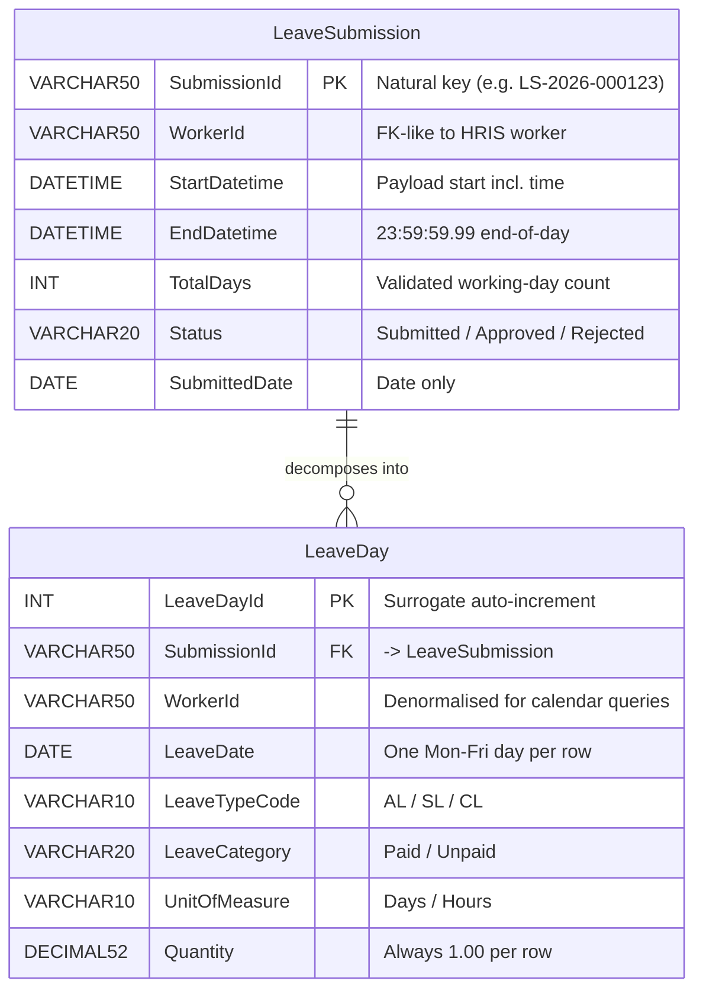

# Solution Design Document (SDD)
## Leave Submission API — Day-Level Persistence

**Version:** 1.0  
**Date:** 2026-03-27  
**Endpoint:** `POST /api/v1/leave-submissions`

---

## 1. Overview

This document describes the design and implementation of a REST API that accepts a worker leave submission payload (JSON) and persists the data into SQL Server at a day-by-day granularity.

The system decomposes a submitted leave period into individual working days (Monday–Friday), validates alignment between the submitted metadata and the actual calendar, and writes both a submission header record and one row per working day in a single atomic transaction.

---

## 2. Architecture & Technology Stack

| Layer | Technology |
|---|---|
| API framework | FastAPI (Python) |
| Validation | Pydantic v2 |
| Database | SQL Server (via `pyodbc`) |
| Testing | Pytest + FastAPI TestClient |
| Runtime | Uvicorn (ASGI) |

---

## 3. Data Modeling Approach

### 3.1 Primary pattern — OLTP 3NF (Inmon-aligned)

The schema follows a normalised **header–detail (parent–child)** structure, which is the hallmark of Inmon's 3NF enterprise data model philosophy:

- `LeaveSubmission` is the **header** — one row per logical submission event, representing the single source of truth for the submission's identity, status, and date range.
- `LeaveDay` is the **detail** — one row per working day within that submission, each independently traceable back to its parent via `SubmissionId` (FK).

This separation ensures that submission-level attributes (status, approver, comments) are stored exactly once, while day-level granularity is achieved through child rows rather than wide pivoted columns or repeated header data. This aligns with Inmon's principle of capturing data at its **lowest meaningful grain** in a normalised form.

### 3.2 Deliberate denormalisation — Kimball influence

`LeaveDay` carries `WorkerId` as a **repeated column**, even though it could be derived by joining to `LeaveSubmission`. This is a conscious Kimball-style trade-off:

> *"Denormalized for fast calendar queries"* — without this, any query of the form "show me all leave days for worker W in month M" would require a join to `LeaveSubmission`. With it, the query hits a single table and the covering index `IX_LeaveDay_WorkerId_Date` resolves it entirely without a lookup.

In Kimball terms, `LeaveDay` behaves like a **Fact table** (grain = one working day per leave type per submission), and `WorkerId` is a degenerate dimension carried directly on the fact row. The absence of explicit `DimWorker` or `DimLeaveType` tables is intentional — those dimensions are owned by the source HRIS system and are out of scope for this API.

### 3.3 Why not Star Schema or Medallion?

**Star Schema** is optimised for analytical query patterns (aggregations, slicing by dimension). This schema serves an OLTP write path — the priority is transactional integrity, idempotency, and referential consistency, not dimensional drill-down. A Star Schema here would introduce unnecessary join complexity for no read-side benefit in this context.

**Medallion** (Bronze → Silver → Gold) is a lakehouse-layer architecture pattern, typically implemented in Databricks or similar platforms. It is not applicable to a relational SQL Server OLTP store.

### 3.4 Summary

| Characteristic | Pattern applied | Evidence in schema |
|---|---|---|
| Header–detail normalisation | Inmon 3NF | `LeaveSubmission` → `LeaveDay` via FK |
| Single source of truth | Inmon | `SubmissionId` as natural PK, no duplication of header data |
| Performance denormalisation | Kimball | `WorkerId` repeated on `LeaveDay` |
| Day-level fact grain | Kimball Fact table concept | One row per Mon–Fri day per leave type |
| Dimensional lookups | Out of scope | No `DimWorker` / `DimLeaveType` tables |
| Star Schema | Not applied | OLTP write path, not analytical read path |
| Medallion | Not applicable | SQL Server OLTP, not a lakehouse |

---

## 4. Request Flow

| Step | Stage | Tag | Description |
|------|-------|-----|-------------|
| 1 | Parse & structural validate | Pydantic | All required fields must be present. Field types are coerced (e.g. `startDate` string → `datetime`). Missing or wrong-type fields return `HTTP 422` immediately. |
| 2 | Date order check | model_validator | A Pydantic model validator on `LeavePeriod` asserts `startDate ≤ endDate`. Raises `HTTP 422` if violated. |
| 3 | Working-day alignment check | Business rule | Counts actual Mon–Fri days in the range. Must equal `totalWorkingDays` AND the sum of `leaveDetail.quantity` (for "Days" unit). Returns `HTTP 400` on mismatch. |
| 4 | Idempotency / duplicate check | Business rule | Queries `dbo.LeaveSubmission` for an existing row with the same `SubmissionId`. Returns `HTTP 409 Conflict` if already present. |
| 5 | Day decomposition | Business logic | Iterates calendar days from start → end, emitting one `LeaveDayRecord` per Mon–Fri day. Per-day quantity is always `1.00` regardless of the total. |
| 6 | Atomic DB write | SQL Server | Inserts `LeaveSubmission` header first, then bulk-inserts all `LeaveDay` rows via `executemany` in a single transaction. Rolled back entirely on any error. |
| 7 | 201 Created response | Done | Returns `submissionId`, `workerId`, `totalWorkingDaysCreated`, and the full list of `leaveDays` for the caller to confirm. |

---

## 5. Day Decomposition

**Sample payload: 2 Mar – 20 Mar 2026**

The 3-week period contains **15 working days** (Mon–Fri). Weekends are skipped — 6 days in total across 3 weekends.

| Mon | Tue | Wed | Thu | Fri | Sat | Sun |
|-----|-----|-----|-----|-----|-----|-----|
| 03/02 ✓ | 03/03 ✓ | 03/04 ✓ | 03/05 ✓ | 03/06 ✓ | 03/07 — | 03/08 — |
| 03/09 ✓ | 03/10 ✓ | 03/11 ✓ | 03/12 ✓ | 03/13 ✓ | 03/14 — | 03/15 — |
| 03/16 ✓ | 03/17 ✓ | 03/18 ✓ | 03/19 ✓ | 03/20 ✓ | — | — |

> ✓ Working day — persisted to `dbo.LeaveDay` &nbsp;|&nbsp; — Weekend, skipped

Each working day produces 1 row in `dbo.LeaveDay` with `LeaveTypeCode = AL`, `Quantity = 1.00`, linked to `LS-2026-000123`.

Public holidays are out of scope and are not excluded by the current implementation.

---

## 6. Database Schema

### 6.1 dbo.LeaveSubmission

One row per submission. `SubmissionId` is the caller-supplied natural key — no surrogate key is needed since it must be globally unique and is stable by design.

| Column | Type | Notes |
|--------|------|-------|
| **SubmissionId** `PK` | `VARCHAR(50)` | e.g. LS-2026-000123 |
| WorkerId | `VARCHAR(50)` | FK-like; worker table not in scope |
| StartDatetime | `DATETIME` | Preserves time component from payload |
| EndDatetime | `DATETIME` | 23:59:59.99 for end-of-day semantics |
| TotalDays | `INT` | Matches validated working-day count |
| Status | `VARCHAR(20)` | Submitted / Approved / Rejected |
| SubmittedDate | `DATE` | Date only, no time |

### 6.2 dbo.LeaveDay

One row per working day per leave type. The unique constraint on `(WorkerId, LeaveDate, LeaveTypeCode)` prevents duplicate day entries at the database level as a safety net independent of the application-layer idempotency check.

| Column | Type | Notes |
|--------|------|-------|
| **LeaveDayId** `PK` | `INT IDENTITY` | Surrogate, auto-increment |
| SubmissionId `FK` | `VARCHAR(50)` | → LeaveSubmission.SubmissionId |
| WorkerId | `VARCHAR(50)` | Denormalized for fast calendar queries (Kimball pattern) |
| LeaveDate | `DATE` | One Mon–Fri day per row |
| LeaveTypeCode | `VARCHAR(10)` | AL, SL, CL … |
| LeaveCategory | `VARCHAR(20)` | Paid / Unpaid |
| UnitOfMeasure | `VARCHAR(10)` | Days / Hours |
| Quantity | `DECIMAL(5,2)` | Always 1.00 per day row |

**Indexes:** `IX_LeaveDay_SubmissionId` · `IX_LeaveDay_WorkerId_Date` · `UQ (WorkerId, LeaveDate, LeaveTypeCode)`

### 6.3 Entity relationship



> `||--o{` — `LeaveSubmission` 1건은 0개 이상의 `LeaveDay`로 분해됨. `WorkerId`가 양쪽 테이블에 존재하는 것이 Kimball 스타일 비정규화 포인트 (섹션 3.2 참조).

---

## 7. HTTP Responses

| Code | Status | Description |
|------|--------|-------------|
| `201` | Created | Submission accepted, all day rows written. Response includes `totalWorkingDaysCreated` and the full `leaveDays` array. |
| `400` | Bad Request — business rule violation | Actual Mon–Fri count doesn't match `totalWorkingDays`, or quantity sum is inconsistent. Message describes the mismatch numerically. |
| `409` | Conflict — duplicate submission | `SubmissionId` already exists in `dbo.LeaveSubmission`. Callers must use a new ID to resubmit. |
| `422` | Unprocessable Entity — validation failure | Required fields missing, wrong types, or constraint violations caught by Pydantic (e.g. `startDate > endDate`, empty `leaveDetails`). |
| `500` | Internal Server Error | Database connection failure or unexpected exception. Transaction is rolled back — no partial data is written. Safe to retry with the same payload. |

---

## 8. File Structure

| File | Purpose |
|---|---|
| `schema.sql` | DDL — creates both tables with PK, FK, unique constraint, and indexes |
| `models.py` | Pydantic v2 request/response schemas |
| `business_logic.py` | Pure-Python day decomposition and alignment validation (no DB dependency) |
| `database.py` | `pyodbc` persistence layer — single context manager wraps commit/rollback |
| `main.py` | FastAPI app with the POST endpoint and global exception handlers |
| `tests/test_leave_submission.py` | Pytest suite — DB is mocked; covers all HTTP status codes |

---

## 9. Running Locally

```bash
pip install -r requirements.txt
uvicorn main:app --reload   # API at http://localhost:8000
pytest tests/ -v            # Full test suite (no DB connection required)
```

---

## 10. Known Constraints & Future Considerations

| Item | Current state | Suggested next step |
|---|---|---|
| Public holidays | Out of scope — not excluded from working-day count | Integrate a public holiday calendar (e.g. `holidays` Python library) into `_is_working_day()` |
| Part-day leave | `Quantity` fixed at `1.00` per day row | Extend decomposition logic to accept fractional quantities (e.g. half-days) |
| Multiple leave types in one period | Supported — each `leaveDetail` item produces its own set of day rows | Validate that quantities across types sum to `totalWorkingDays` |
| Worker dimension | `WorkerId` is a bare string with no FK to a worker table | Add `dbo.Worker` reference table and enforce referential integrity |
| Analytical reporting | Current schema is OLTP-optimised | For reporting, consider a Gold-layer view or Star Schema projection on top of these tables |

---

## 11. Alternative Solution Comparison — Node.js + Express vs Python + FastAPI

An alternative implementation using **Node.js, Express, and `mssql`** was reviewed against this solution. The two approaches share the same core logic (working-day decomposition, transactional persistence, FK structure, `Quantity = 1.00` per day), but differ in completeness and production-readiness.

### 11.1 Feature comparison

| Item | Node.js + Express | Python + FastAPI | Assessment |
|---|---|---|---|
| Runtime & framework | Node.js + Express | Python + FastAPI | Functionally equivalent |
| Input field casing | `LEAVESUBMISSION`, `WORKERID` (UPPERCASE) | `leaveSubmission`, `workerId` (camelCase) | ⚠️ Node.js deviates from the payload spec |
| Input validation | Manual `if` checks | Pydantic v2 automatic | ⚠️ Node.js risks runtime errors on missing nested fields |
| Duplicate submission handling | ❌ Not implemented | ✅ HTTP 409 returned | ⚠️ Node.js lets DB constraint violation surface as HTTP 500 |
| `leaveDetail` quantity sum check | ❌ Not implemented | ✅ Validated against `totalWorkingDays` | ⚠️ Node.js skips this business rule |
| Multiple `leaveDetails` support | ❌ Hardcoded `[0]` only | ✅ Full iteration over all items | ⚠️ Node.js silently drops all but the first leave type |
| DB insert strategy | `await` per row in loop (N+1) | `executemany` batch | ⚠️ Node.js makes 15 round-trips for a 15-day submission |
| Index definitions in DDL | ❌ None | ✅ 2 indexes + UQ constraint | ⚠️ Node.js calendar queries will be slower without indexes |
| HTTP status code granularity | `400` for all errors | `400` / `409` / `422` / `500` distinct | ⚠️ Node.js is less RESTful — clients cannot distinguish error types |
| Test coverage | ❌ None | ✅ Pytest suite, DB mocked | ⚠️ Node.js behaviour cannot be verified without a live DB |

### 11.2 Key risks in the Node.js + Express solution

**Risk 1 — Duplicate submission surfaces as HTTP 500.**
Without an explicit idempotency check, a repeated `SubmissionId` hits the DB `PRIMARY KEY` constraint and returns a generic `500 Internal Server Error`. The caller cannot distinguish a server fault from a duplicate submission, making safe retry logic impossible.

**Risk 2 — `leaveDetails[0]` hardcoding.**
The comment in the source acknowledges this: `// Assuming single type for simplicity`. In production, any payload with multiple leave types would silently persist only the first type's days — a data integrity failure with no error raised.

**Risk 3 — N+1 insert pattern.**
Inserting each `LeaveDay` row in a sequential `await` loop means 15 database round-trips for a 15-day submission, 65 for a quarter, and so on. The `executemany` batch approach in Python + FastAPI reduces that to a single network call.

### 11.3 Verdict

The Node.js + Express solution is a **functional prototype** that demonstrates the correct conceptual approach. It would work correctly for the happy-path case in a controlled demo. Python + FastAPI targets **production readiness** — covering idempotency, multi-type leave, batch persistence, index-backed queries, and a full test suite.